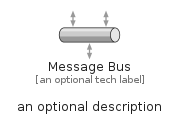
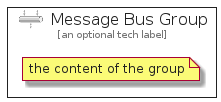

# MessageBus


```text
eip-1/MessagingChannels/MessageBus
```

```text
include('eip-1/MessagingChannels/MessageBus')
```


| Illustration | MessageBus | MessageBusGroup |
| :---: | :---: | :---: |
|  |  |  |


## MessageBus

### Load remotely
```plantuml
@startuml
' configures the library
!global $LIB_BASE_LOCATION="https://raw.githubusercontent.com/tmorin/plantuml-libs/master/distribution"

' loads the library's bootstrap
!include $LIB_BASE_LOCATION/bootstrap.puml

' loads the package bootstrap
include('eip-1/bootstrap')

' loads the Item which embeds the element MessageBus
include('eip-1/MessagingChannels/MessageBus')

' renders the element
MessageBus('MessageBus', 'Message Bus', 'an optional tech label')
@enduml
```

### Load locally
```plantuml
@startuml
' configures the library
!global $INCLUSION_MODE="local"
!global $LIB_BASE_LOCATION="../.."

' loads the library's bootstrap
!include $LIB_BASE_LOCATION/bootstrap.puml

' loads the package bootstrap
include('eip-1/bootstrap')

' loads the Item which embeds the element MessageBus
include('eip-1/MessagingChannels/MessageBus')

' renders the element
MessageBus('MessageBus', 'Message Bus', 'an optional tech label')
@enduml
```

## MessageBusGroup

### Load remotely
```plantuml
@startuml
' configures the library
!global $LIB_BASE_LOCATION="https://raw.githubusercontent.com/tmorin/plantuml-libs/master/distribution"

' loads the library's bootstrap
!include $LIB_BASE_LOCATION/bootstrap.puml

' loads the package bootstrap
include('eip-1/bootstrap')

' loads the Item which embeds the element MessageBusGroup
include('eip-1/MessagingChannels/MessageBus')

' renders the element
MessageBusGroup('MessageBusGroup', 'Message Bus Group', 'an optional tech label') {
    note as note
        the content of the group
    end note
}
@enduml
```

### Load locally
```plantuml
@startuml
' configures the library
!global $INCLUSION_MODE="local"
!global $LIB_BASE_LOCATION="../.."

' loads the library's bootstrap
!include $LIB_BASE_LOCATION/bootstrap.puml

' loads the package bootstrap
include('eip-1/bootstrap')

' loads the Item which embeds the element MessageBusGroup
include('eip-1/MessagingChannels/MessageBus')

' renders the element
MessageBusGroup('MessageBusGroup', 'Message Bus Group', 'an optional tech label') {
    note as note
        the content of the group
    end note
}
@enduml
```

