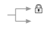
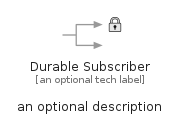
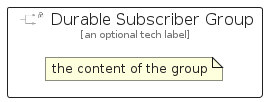

# DurableSubscriber


```text
eip-1/MessagingEndpoints/DurableSubscriber
```

```text
include('eip-1/MessagingEndpoints/DurableSubscriber')
```


| Illustration | DurableSubscriber | DurableSubscriberGroup |
| :---: | :---: | :---: |
|  |  |  |


## Sprites
The item provides the following sriptes:

- `<$DurableSubscriberXs>`
- `<$DurableSubscriberSm>`
- `<$DurableSubscriberMd>`
- `<$DurableSubscriberLg>`


## DurableSubscriber

### Load remotely
```plantuml
@startuml
' configures the library
!global $LIB_BASE_LOCATION="https://raw.githubusercontent.com/tmorin/plantuml-libs/master/distribution"

' loads the library's bootstrap
!include $LIB_BASE_LOCATION/bootstrap.puml

' loads the package bootstrap
include('eip-1/bootstrap')

' loads the Item which embeds the element DurableSubscriber
include('eip-1/MessagingEndpoints/DurableSubscriber')

' renders the element
DurableSubscriber('DurableSubscriber', 'Durable Subscriber', 'an optional tech label', 'an optional description')
@enduml
```

### Load locally
```plantuml
@startuml
' configures the library
!global $INCLUSION_MODE="local"
!global $LIB_BASE_LOCATION="../.."

' loads the library's bootstrap
!include $LIB_BASE_LOCATION/bootstrap.puml

' loads the package bootstrap
include('eip-1/bootstrap')

' loads the Item which embeds the element DurableSubscriber
include('eip-1/MessagingEndpoints/DurableSubscriber')

' renders the element
DurableSubscriber('DurableSubscriber', 'Durable Subscriber', 'an optional tech label', 'an optional description')
@enduml
```

## DurableSubscriberGroup

### Load remotely
```plantuml
@startuml
' configures the library
!global $LIB_BASE_LOCATION="https://raw.githubusercontent.com/tmorin/plantuml-libs/master/distribution"

' loads the library's bootstrap
!include $LIB_BASE_LOCATION/bootstrap.puml

' loads the package bootstrap
include('eip-1/bootstrap')

' loads the Item which embeds the element DurableSubscriberGroup
include('eip-1/MessagingEndpoints/DurableSubscriber')

' renders the element
DurableSubscriberGroup('DurableSubscriberGroup', 'Durable Subscriber Group', 'an optional tech label') {
    note as note
        the content of the group
    end note
}
@enduml
```

### Load locally
```plantuml
@startuml
' configures the library
!global $INCLUSION_MODE="local"
!global $LIB_BASE_LOCATION="../.."

' loads the library's bootstrap
!include $LIB_BASE_LOCATION/bootstrap.puml

' loads the package bootstrap
include('eip-1/bootstrap')

' loads the Item which embeds the element DurableSubscriberGroup
include('eip-1/MessagingEndpoints/DurableSubscriber')

' renders the element
DurableSubscriberGroup('DurableSubscriberGroup', 'Durable Subscriber Group', 'an optional tech label') {
    note as note
        the content of the group
    end note
}
@enduml
```

