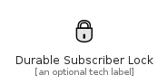
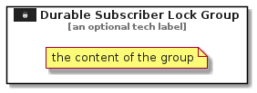

# DurableSubscriberLock


```text
eip-1/MessagingEndpoints/DurableSubscriberLock
```

```text
include('eip-1/MessagingEndpoints/DurableSubscriberLock')
```


| Illustration | DurableSubscriberLock | DurableSubscriberLockGroup |
| :---: | :---: | :---: |
|  |  |  |


## DurableSubscriberLock

### Load remotely
```plantuml
@startuml
' configures the library
!global $LIB_BASE_LOCATION="https://github.com/tmorin/plantuml-libs/distribution"

' loads the library's bootstrap
!include $LIB_BASE_LOCATION/bootstrap.puml

' loads the package bootstrap
include('eip-1/bootstrap')

' loads the Item which embeds the element DurableSubscriberLock
include('eip-1/MessagingEndpoints/DurableSubscriberLock')

' renders the element
DurableSubscriberLock('DurableSubscriberLock', 'Durable Subscriber Lock', 'an optional tech label')
@enduml
```

### Load locally
```plantuml
@startuml
' configures the library
!global $INCLUSION_MODE="local"
!global $LIB_BASE_LOCATION="../.."

' loads the library's bootstrap
!include $LIB_BASE_LOCATION/bootstrap.puml

' loads the package bootstrap
include('eip-1/bootstrap')

' loads the Item which embeds the element DurableSubscriberLock
include('eip-1/MessagingEndpoints/DurableSubscriberLock')

' renders the element
DurableSubscriberLock('DurableSubscriberLock', 'Durable Subscriber Lock', 'an optional tech label')
@enduml
```

## DurableSubscriberLockGroup

### Load remotely
```plantuml
@startuml
' configures the library
!global $LIB_BASE_LOCATION="https://github.com/tmorin/plantuml-libs/distribution"

' loads the library's bootstrap
!include $LIB_BASE_LOCATION/bootstrap.puml

' loads the package bootstrap
include('eip-1/bootstrap')

' loads the Item which embeds the element DurableSubscriberLockGroup
include('eip-1/MessagingEndpoints/DurableSubscriberLock')

' renders the element
DurableSubscriberLockGroup('DurableSubscriberLockGroup', 'Durable Subscriber Lock Group', 'an optional tech label') {
    note as note
        the content of the group
    end note
}
@enduml
```

### Load locally
```plantuml
@startuml
' configures the library
!global $INCLUSION_MODE="local"
!global $LIB_BASE_LOCATION="../.."

' loads the library's bootstrap
!include $LIB_BASE_LOCATION/bootstrap.puml

' loads the package bootstrap
include('eip-1/bootstrap')

' loads the Item which embeds the element DurableSubscriberLockGroup
include('eip-1/MessagingEndpoints/DurableSubscriberLock')

' renders the element
DurableSubscriberLockGroup('DurableSubscriberLockGroup', 'Durable Subscriber Lock Group', 'an optional tech label') {
    note as note
        the content of the group
    end note
}
@enduml
```

