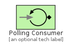

# PollingConsumer


```text
eip-1/MessagingEndpoints/PollingConsumer
```

```text
include('eip-1/MessagingEndpoints/PollingConsumer')
```


| Illustration | PollingConsumer | PollingConsumerGroup |
| :---: | :---: | :---: |
|  |  |  |


## Sprites
The item provides the following sriptes:

- `<$PollingConsumerXs>`
- `<$PollingConsumerSm>`
- `<$PollingConsumerMd>`
- `<$PollingConsumerLg>`


## PollingConsumer

### Load remotely
```plantuml
@startuml
' configures the library
!global $LIB_BASE_LOCATION="https://raw.githubusercontent.com/tmorin/plantuml-libs/master/distribution"

' loads the library's bootstrap
!include $LIB_BASE_LOCATION/bootstrap.puml

' loads the package bootstrap
include('eip-1/bootstrap')

' loads the Item which embeds the element PollingConsumer
include('eip-1/MessagingEndpoints/PollingConsumer')

' renders the element
PollingConsumer('PollingConsumer', 'Polling Consumer', 'an optional tech label', 'an optional description')
@enduml
```

### Load locally
```plantuml
@startuml
' configures the library
!global $INCLUSION_MODE="local"
!global $LIB_BASE_LOCATION="../.."

' loads the library's bootstrap
!include $LIB_BASE_LOCATION/bootstrap.puml

' loads the package bootstrap
include('eip-1/bootstrap')

' loads the Item which embeds the element PollingConsumer
include('eip-1/MessagingEndpoints/PollingConsumer')

' renders the element
PollingConsumer('PollingConsumer', 'Polling Consumer', 'an optional tech label', 'an optional description')
@enduml
```

## PollingConsumerGroup

### Load remotely
```plantuml
@startuml
' configures the library
!global $LIB_BASE_LOCATION="https://raw.githubusercontent.com/tmorin/plantuml-libs/master/distribution"

' loads the library's bootstrap
!include $LIB_BASE_LOCATION/bootstrap.puml

' loads the package bootstrap
include('eip-1/bootstrap')

' loads the Item which embeds the element PollingConsumerGroup
include('eip-1/MessagingEndpoints/PollingConsumer')

' renders the element
PollingConsumerGroup('PollingConsumerGroup', 'Polling Consumer Group', 'an optional tech label') {
    note as note
        the content of the group
    end note
}
@enduml
```

### Load locally
```plantuml
@startuml
' configures the library
!global $INCLUSION_MODE="local"
!global $LIB_BASE_LOCATION="../.."

' loads the library's bootstrap
!include $LIB_BASE_LOCATION/bootstrap.puml

' loads the package bootstrap
include('eip-1/bootstrap')

' loads the Item which embeds the element PollingConsumerGroup
include('eip-1/MessagingEndpoints/PollingConsumer')

' renders the element
PollingConsumerGroup('PollingConsumerGroup', 'Polling Consumer Group', 'an optional tech label') {
    note as note
        the content of the group
    end note
}
@enduml
```

