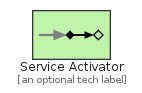
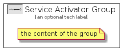

# ServiceActivator


```text
eip-1/MessagingEndpoints/ServiceActivator
```

```text
include('eip-1/MessagingEndpoints/ServiceActivator')
```


| Illustration | ServiceActivator | ServiceActivatorGroup |
| :---: | :---: | :---: |
|  |  |  |


## Sprites
The item provides the following sriptes:

- `<$ServiceActivatorXs>`
- `<$ServiceActivatorSm>`
- `<$ServiceActivatorMd>`
- `<$ServiceActivatorLg>`


## ServiceActivator

### Load remotely
```plantuml
@startuml
' configures the library
!global $LIB_BASE_LOCATION="https://raw.githubusercontent.com/tmorin/plantuml-libs/master/distribution"

' loads the library's bootstrap
!include $LIB_BASE_LOCATION/bootstrap.puml

' loads the package bootstrap
include('eip-1/bootstrap')

' loads the Item which embeds the element ServiceActivator
include('eip-1/MessagingEndpoints/ServiceActivator')

' renders the element
ServiceActivator('ServiceActivator', 'Service Activator', 'an optional tech label', 'an optional description')
@enduml
```

### Load locally
```plantuml
@startuml
' configures the library
!global $INCLUSION_MODE="local"
!global $LIB_BASE_LOCATION="../.."

' loads the library's bootstrap
!include $LIB_BASE_LOCATION/bootstrap.puml

' loads the package bootstrap
include('eip-1/bootstrap')

' loads the Item which embeds the element ServiceActivator
include('eip-1/MessagingEndpoints/ServiceActivator')

' renders the element
ServiceActivator('ServiceActivator', 'Service Activator', 'an optional tech label', 'an optional description')
@enduml
```

## ServiceActivatorGroup

### Load remotely
```plantuml
@startuml
' configures the library
!global $LIB_BASE_LOCATION="https://raw.githubusercontent.com/tmorin/plantuml-libs/master/distribution"

' loads the library's bootstrap
!include $LIB_BASE_LOCATION/bootstrap.puml

' loads the package bootstrap
include('eip-1/bootstrap')

' loads the Item which embeds the element ServiceActivatorGroup
include('eip-1/MessagingEndpoints/ServiceActivator')

' renders the element
ServiceActivatorGroup('ServiceActivatorGroup', 'Service Activator Group', 'an optional tech label') {
    note as note
        the content of the group
    end note
}
@enduml
```

### Load locally
```plantuml
@startuml
' configures the library
!global $INCLUSION_MODE="local"
!global $LIB_BASE_LOCATION="../.."

' loads the library's bootstrap
!include $LIB_BASE_LOCATION/bootstrap.puml

' loads the package bootstrap
include('eip-1/bootstrap')

' loads the Item which embeds the element ServiceActivatorGroup
include('eip-1/MessagingEndpoints/ServiceActivator')

' renders the element
ServiceActivatorGroup('ServiceActivatorGroup', 'Service Activator Group', 'an optional tech label') {
    note as note
        the content of the group
    end note
}
@enduml
```

