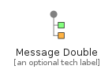
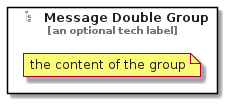

# MessageDouble


```text
eip-1/MessagingSystems/MessageDouble
```

```text
include('eip-1/MessagingSystems/MessageDouble')
```


| Illustration | MessageDouble | MessageDoubleGroup |
| :---: | :---: | :---: |
|  |  |  |


## MessageDouble

### Load remotely
```plantuml
@startuml
' configures the library
!global $LIB_BASE_LOCATION="https://raw.githubusercontent.com/tmorin/plantuml-libs/master/distribution"

' loads the library's bootstrap
!include $LIB_BASE_LOCATION/bootstrap.puml

' loads the package bootstrap
include('eip-1/bootstrap')

' loads the Item which embeds the element MessageDouble
include('eip-1/MessagingSystems/MessageDouble')

' renders the element
MessageDouble('MessageDouble', 'Message Double', 'an optional tech label')
@enduml
```

### Load locally
```plantuml
@startuml
' configures the library
!global $INCLUSION_MODE="local"
!global $LIB_BASE_LOCATION="../.."

' loads the library's bootstrap
!include $LIB_BASE_LOCATION/bootstrap.puml

' loads the package bootstrap
include('eip-1/bootstrap')

' loads the Item which embeds the element MessageDouble
include('eip-1/MessagingSystems/MessageDouble')

' renders the element
MessageDouble('MessageDouble', 'Message Double', 'an optional tech label')
@enduml
```

## MessageDoubleGroup

### Load remotely
```plantuml
@startuml
' configures the library
!global $LIB_BASE_LOCATION="https://raw.githubusercontent.com/tmorin/plantuml-libs/master/distribution"

' loads the library's bootstrap
!include $LIB_BASE_LOCATION/bootstrap.puml

' loads the package bootstrap
include('eip-1/bootstrap')

' loads the Item which embeds the element MessageDoubleGroup
include('eip-1/MessagingSystems/MessageDouble')

' renders the element
MessageDoubleGroup('MessageDoubleGroup', 'Message Double Group', 'an optional tech label') {
    note as note
        the content of the group
    end note
}
@enduml
```

### Load locally
```plantuml
@startuml
' configures the library
!global $INCLUSION_MODE="local"
!global $LIB_BASE_LOCATION="../.."

' loads the library's bootstrap
!include $LIB_BASE_LOCATION/bootstrap.puml

' loads the package bootstrap
include('eip-1/bootstrap')

' loads the Item which embeds the element MessageDoubleGroup
include('eip-1/MessagingSystems/MessageDouble')

' renders the element
MessageDoubleGroup('MessageDoubleGroup', 'Message Double Group', 'an optional tech label') {
    note as note
        the content of the group
    end note
}
@enduml
```

