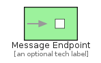

# MessageEndpoint


```text
eip-1/MessagingSystems/MessageEndpoint
```

```text
include('eip-1/MessagingSystems/MessageEndpoint')
```


| Illustration | MessageEndpoint | MessageEndpointGroup |
| :---: | :---: | :---: |
|  |  |  |


## MessageEndpoint

### Load remotely
```plantuml
@startuml
' configures the library
!global $LIB_BASE_LOCATION="https://raw.githubusercontent.com/tmorin/plantuml-libs/master/distribution"

' loads the library's bootstrap
!include $LIB_BASE_LOCATION/bootstrap.puml

' loads the package bootstrap
include('eip-1/bootstrap')

' loads the Item which embeds the element MessageEndpoint
include('eip-1/MessagingSystems/MessageEndpoint')

' renders the element
MessageEndpoint('MessageEndpoint', 'Message Endpoint', 'an optional tech label')
@enduml
```

### Load locally
```plantuml
@startuml
' configures the library
!global $INCLUSION_MODE="local"
!global $LIB_BASE_LOCATION="../.."

' loads the library's bootstrap
!include $LIB_BASE_LOCATION/bootstrap.puml

' loads the package bootstrap
include('eip-1/bootstrap')

' loads the Item which embeds the element MessageEndpoint
include('eip-1/MessagingSystems/MessageEndpoint')

' renders the element
MessageEndpoint('MessageEndpoint', 'Message Endpoint', 'an optional tech label')
@enduml
```

## MessageEndpointGroup

### Load remotely
```plantuml
@startuml
' configures the library
!global $LIB_BASE_LOCATION="https://raw.githubusercontent.com/tmorin/plantuml-libs/master/distribution"

' loads the library's bootstrap
!include $LIB_BASE_LOCATION/bootstrap.puml

' loads the package bootstrap
include('eip-1/bootstrap')

' loads the Item which embeds the element MessageEndpointGroup
include('eip-1/MessagingSystems/MessageEndpoint')

' renders the element
MessageEndpointGroup('MessageEndpointGroup', 'Message Endpoint Group', 'an optional tech label') {
    note as note
        the content of the group
    end note
}
@enduml
```

### Load locally
```plantuml
@startuml
' configures the library
!global $INCLUSION_MODE="local"
!global $LIB_BASE_LOCATION="../.."

' loads the library's bootstrap
!include $LIB_BASE_LOCATION/bootstrap.puml

' loads the package bootstrap
include('eip-1/bootstrap')

' loads the Item which embeds the element MessageEndpointGroup
include('eip-1/MessagingSystems/MessageEndpoint')

' renders the element
MessageEndpointGroup('MessageEndpointGroup', 'Message Endpoint Group', 'an optional tech label') {
    note as note
        the content of the group
    end note
}
@enduml
```

