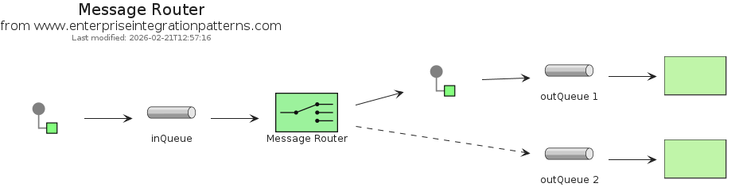
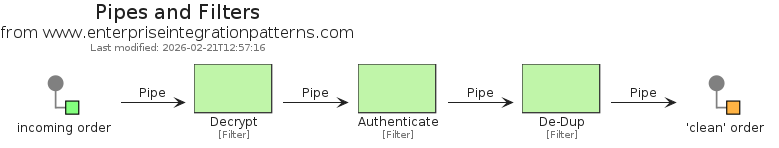
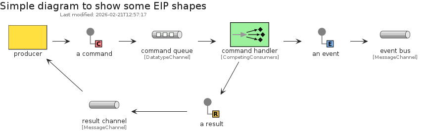

# eip-1

## Presentation
This package implements elements based on [codeclou/enterprise-integration-pattern-shapes-for-gliffy](https://github.com/codeclou/enterprise-integration-pattern-shapes-for-gliffy).

## Bootstrap

The bootstrap may provide PlantUML artifacts like constants, procedures or style statements.

```plantuml
' loads the eip-1 bootstrap
include('eip-1/bootstrap')
```


# Modules

The package provides 7 modules.

- [eip-1/MessageConstruction](../eip-1/MessageConstruction/README.md) with 10 items
- [eip-1/MessageRouting](../eip-1/MessageRouting/README.md) with 11 items
- [eip-1/MessageTransformation](../eip-1/MessageTransformation/README.md) with 5 items
- [eip-1/MessagingChannels](../eip-1/MessagingChannels/README.md) with 8 items
- [eip-1/MessagingEndpoints](../eip-1/MessagingEndpoints/README.md) with 11 items
- [eip-1/MessagingSystems](../eip-1/MessagingSystems/README.md) with 9 items
- [eip-1/SystemManagement](../eip-1/SystemManagement/README.md) with 7 items


# Examples

The package provides 3 examples.

## Message router

<br>
[The source file.](../eip-1/message_router.puml)

## Pipes and filters

<br>
[The source file.](../eip-1/pipes_and_filters.puml)

## Simple

<br>
[The source file.](../eip-1/simple.puml)


