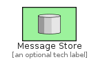
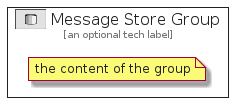

# MessageStore


```text
eip-1/SystemManagement/MessageStore
```

```text
include('eip-1/SystemManagement/MessageStore')
```


| Illustration | MessageStore | MessageStoreGroup |
| :---: | :---: | :---: |
|  |  |  |


## MessageStore

### Load remotely
```plantuml
@startuml
' configures the library
!global $LIB_BASE_LOCATION="https://github.com/tmorin/plantuml-libs/distribution"

' loads the library's bootstrap
!include $LIB_BASE_LOCATION/bootstrap.puml

' loads the package bootstrap
include('eip-1/bootstrap')

' loads the Item which embeds the element MessageStore
include('eip-1/SystemManagement/MessageStore')

' renders the element
MessageStore('MessageStore', 'Message Store', 'an optional tech label')
@enduml
```

### Load locally
```plantuml
@startuml
' configures the library
!global $INCLUSION_MODE="local"
!global $LIB_BASE_LOCATION="../.."

' loads the library's bootstrap
!include $LIB_BASE_LOCATION/bootstrap.puml

' loads the package bootstrap
include('eip-1/bootstrap')

' loads the Item which embeds the element MessageStore
include('eip-1/SystemManagement/MessageStore')

' renders the element
MessageStore('MessageStore', 'Message Store', 'an optional tech label')
@enduml
```

## MessageStoreGroup

### Load remotely
```plantuml
@startuml
' configures the library
!global $LIB_BASE_LOCATION="https://github.com/tmorin/plantuml-libs/distribution"

' loads the library's bootstrap
!include $LIB_BASE_LOCATION/bootstrap.puml

' loads the package bootstrap
include('eip-1/bootstrap')

' loads the Item which embeds the element MessageStoreGroup
include('eip-1/SystemManagement/MessageStore')

' renders the element
MessageStoreGroup('MessageStoreGroup', 'Message Store Group', 'an optional tech label') {
    note as note
        the content of the group
    end note
}
@enduml
```

### Load locally
```plantuml
@startuml
' configures the library
!global $INCLUSION_MODE="local"
!global $LIB_BASE_LOCATION="../.."

' loads the library's bootstrap
!include $LIB_BASE_LOCATION/bootstrap.puml

' loads the package bootstrap
include('eip-1/bootstrap')

' loads the Item which embeds the element MessageStoreGroup
include('eip-1/SystemManagement/MessageStore')

' renders the element
MessageStoreGroup('MessageStoreGroup', 'Message Store Group', 'an optional tech label') {
    note as note
        the content of the group
    end note
}
@enduml
```

