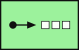

# SystemManagement

The module contains 7 items.

| |Name|
|:---:|---|
|  | [eip-1/SystemManagement/ChannelPurger](../../eip-1/SystemManagement/ChannelPurger.md) |
|  | [eip-1/SystemManagement/ControlBus](../../eip-1/SystemManagement/ControlBus.md) |
|  | [eip-1/SystemManagement/Detour](../../eip-1/SystemManagement/Detour.md) |
|  | [eip-1/SystemManagement/MessageStore](../../eip-1/SystemManagement/MessageStore.md) |
|  | [eip-1/SystemManagement/SmartProxy](../../eip-1/SystemManagement/SmartProxy.md) |
|  | [eip-1/SystemManagement/TestMessage](../../eip-1/SystemManagement/TestMessage.md) |
|  | [eip-1/SystemManagement/WireTap](../../eip-1/SystemManagement/WireTap.md) |

