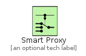
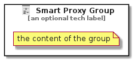

# SmartProxy


```text
eip-1/SystemManagement/SmartProxy
```

```text
include('eip-1/SystemManagement/SmartProxy')
```


| Illustration | SmartProxy | SmartProxyGroup |
| :---: | :---: | :---: |
|  |  |  |


## SmartProxy

### Load remotely
```plantuml
@startuml
' configures the library
!global $LIB_BASE_LOCATION="https://raw.githubusercontent.com/tmorin/plantuml-libs/master/distribution"

' loads the library's bootstrap
!include $LIB_BASE_LOCATION/bootstrap.puml

' loads the package bootstrap
include('eip-1/bootstrap')

' loads the Item which embeds the element SmartProxy
include('eip-1/SystemManagement/SmartProxy')

' renders the element
SmartProxy('SmartProxy', 'Smart Proxy', 'an optional tech label', 'an optional description')
@enduml
```

### Load locally
```plantuml
@startuml
' configures the library
!global $INCLUSION_MODE="local"
!global $LIB_BASE_LOCATION="../.."

' loads the library's bootstrap
!include $LIB_BASE_LOCATION/bootstrap.puml

' loads the package bootstrap
include('eip-1/bootstrap')

' loads the Item which embeds the element SmartProxy
include('eip-1/SystemManagement/SmartProxy')

' renders the element
SmartProxy('SmartProxy', 'Smart Proxy', 'an optional tech label', 'an optional description')
@enduml
```

## SmartProxyGroup

### Load remotely
```plantuml
@startuml
' configures the library
!global $LIB_BASE_LOCATION="https://raw.githubusercontent.com/tmorin/plantuml-libs/master/distribution"

' loads the library's bootstrap
!include $LIB_BASE_LOCATION/bootstrap.puml

' loads the package bootstrap
include('eip-1/bootstrap')

' loads the Item which embeds the element SmartProxyGroup
include('eip-1/SystemManagement/SmartProxy')

' renders the element
SmartProxyGroup('SmartProxyGroup', 'Smart Proxy Group', 'an optional tech label') {
    note as note
        the content of the group
    end note
}
@enduml
```

### Load locally
```plantuml
@startuml
' configures the library
!global $INCLUSION_MODE="local"
!global $LIB_BASE_LOCATION="../.."

' loads the library's bootstrap
!include $LIB_BASE_LOCATION/bootstrap.puml

' loads the package bootstrap
include('eip-1/bootstrap')

' loads the Item which embeds the element SmartProxyGroup
include('eip-1/SystemManagement/SmartProxy')

' renders the element
SmartProxyGroup('SmartProxyGroup', 'Smart Proxy Group', 'an optional tech label') {
    note as note
        the content of the group
    end note
}
@enduml
```

