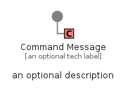
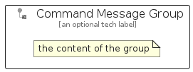

# CommandMessage


```text
eip/MessageConstruction/CommandMessage
```

```text
include('eip/MessageConstruction/CommandMessage')
```


| Illustration | CommandMessage | CommandMessageGroup |
| :---: | :---: | :---: |
|  |  |  |


## Sprites
The item provides the following sriptes:

- `<$CommandMessageXs>`
- `<$CommandMessageSm>`
- `<$CommandMessageMd>`
- `<$CommandMessageLg>`


## CommandMessage

### Load remotely
```plantuml
@startuml
' configures the library
!global $LIB_BASE_LOCATION="https://raw.githubusercontent.com/tmorin/plantuml-libs/master/distribution"

' loads the library's bootstrap
!include $LIB_BASE_LOCATION/bootstrap.puml

' loads the package bootstrap
include('eip/bootstrap')

' loads the Item which embeds the element CommandMessage
include('eip/MessageConstruction/CommandMessage')

' renders the element
CommandMessage('CommandMessage', 'Command Message', 'an optional tech label', 'an optional description')
@enduml
```

### Load locally
```plantuml
@startuml
' configures the library
!global $INCLUSION_MODE="local"
!global $LIB_BASE_LOCATION="../.."

' loads the library's bootstrap
!include $LIB_BASE_LOCATION/bootstrap.puml

' loads the package bootstrap
include('eip/bootstrap')

' loads the Item which embeds the element CommandMessage
include('eip/MessageConstruction/CommandMessage')

' renders the element
CommandMessage('CommandMessage', 'Command Message', 'an optional tech label', 'an optional description')
@enduml
```

## CommandMessageGroup

### Load remotely
```plantuml
@startuml
' configures the library
!global $LIB_BASE_LOCATION="https://raw.githubusercontent.com/tmorin/plantuml-libs/master/distribution"

' loads the library's bootstrap
!include $LIB_BASE_LOCATION/bootstrap.puml

' loads the package bootstrap
include('eip/bootstrap')

' loads the Item which embeds the element CommandMessageGroup
include('eip/MessageConstruction/CommandMessage')

' renders the element
CommandMessageGroup('CommandMessageGroup', 'Command Message Group', 'an optional tech label') {
    note as note
        the content of the group
    end note
}
@enduml
```

### Load locally
```plantuml
@startuml
' configures the library
!global $INCLUSION_MODE="local"
!global $LIB_BASE_LOCATION="../.."

' loads the library's bootstrap
!include $LIB_BASE_LOCATION/bootstrap.puml

' loads the package bootstrap
include('eip/bootstrap')

' loads the Item which embeds the element CommandMessageGroup
include('eip/MessageConstruction/CommandMessage')

' renders the element
CommandMessageGroup('CommandMessageGroup', 'Command Message Group', 'an optional tech label') {
    note as note
        the content of the group
    end note
}
@enduml
```

