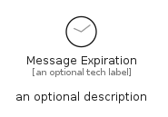
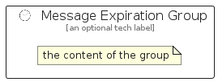

# MessageExpiration


```text
eip/MessageConstruction/MessageExpiration
```

```text
include('eip/MessageConstruction/MessageExpiration')
```


| Illustration | MessageExpiration | MessageExpirationGroup |
| :---: | :---: | :---: |
|  |  |  |


## Sprites
The item provides the following sriptes:

- `<$MessageExpirationXs>`
- `<$MessageExpirationSm>`
- `<$MessageExpirationMd>`
- `<$MessageExpirationLg>`


## MessageExpiration

### Load remotely
```plantuml
@startuml
' configures the library
!global $LIB_BASE_LOCATION="https://raw.githubusercontent.com/tmorin/plantuml-libs/master/distribution"

' loads the library's bootstrap
!include $LIB_BASE_LOCATION/bootstrap.puml

' loads the package bootstrap
include('eip/bootstrap')

' loads the Item which embeds the element MessageExpiration
include('eip/MessageConstruction/MessageExpiration')

' renders the element
MessageExpiration('MessageExpiration', 'Message Expiration', 'an optional tech label', 'an optional description')
@enduml
```

### Load locally
```plantuml
@startuml
' configures the library
!global $INCLUSION_MODE="local"
!global $LIB_BASE_LOCATION="../.."

' loads the library's bootstrap
!include $LIB_BASE_LOCATION/bootstrap.puml

' loads the package bootstrap
include('eip/bootstrap')

' loads the Item which embeds the element MessageExpiration
include('eip/MessageConstruction/MessageExpiration')

' renders the element
MessageExpiration('MessageExpiration', 'Message Expiration', 'an optional tech label', 'an optional description')
@enduml
```

## MessageExpirationGroup

### Load remotely
```plantuml
@startuml
' configures the library
!global $LIB_BASE_LOCATION="https://raw.githubusercontent.com/tmorin/plantuml-libs/master/distribution"

' loads the library's bootstrap
!include $LIB_BASE_LOCATION/bootstrap.puml

' loads the package bootstrap
include('eip/bootstrap')

' loads the Item which embeds the element MessageExpirationGroup
include('eip/MessageConstruction/MessageExpiration')

' renders the element
MessageExpirationGroup('MessageExpirationGroup', 'Message Expiration Group', 'an optional tech label') {
    note as note
        the content of the group
    end note
}
@enduml
```

### Load locally
```plantuml
@startuml
' configures the library
!global $INCLUSION_MODE="local"
!global $LIB_BASE_LOCATION="../.."

' loads the library's bootstrap
!include $LIB_BASE_LOCATION/bootstrap.puml

' loads the package bootstrap
include('eip/bootstrap')

' loads the Item which embeds the element MessageExpirationGroup
include('eip/MessageConstruction/MessageExpiration')

' renders the element
MessageExpirationGroup('MessageExpirationGroup', 'Message Expiration Group', 'an optional tech label') {
    note as note
        the content of the group
    end note
}
@enduml
```

