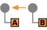
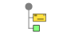
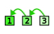

# MessageConstruction

The module contains 10 items.

| |Name|
|:---:|---|
|  | [eip/MessageConstruction/CommandMessage](../../eip/MessageConstruction/CommandMessage.md) |
|  | [eip/MessageConstruction/CorrelationIdentifier](../../eip/MessageConstruction/CorrelationIdentifier.md) |
|  | [eip/MessageConstruction/DocumentMessage](../../eip/MessageConstruction/DocumentMessage.md) |
|  | [eip/MessageConstruction/EventMessage](../../eip/MessageConstruction/EventMessage.md) |
|  | [eip/MessageConstruction/MessageExpiration](../../eip/MessageConstruction/MessageExpiration.md) |
|  | [eip/MessageConstruction/MessageReturnAddress](../../eip/MessageConstruction/MessageReturnAddress.md) |
|  | [eip/MessageConstruction/MessageSequence](../../eip/MessageConstruction/MessageSequence.md) |
|  | [eip/MessageConstruction/QueryMessage](../../eip/MessageConstruction/QueryMessage.md) |
|  | [eip/MessageConstruction/ResultMessage](../../eip/MessageConstruction/ResultMessage.md) |
|  | [eip/MessageConstruction/ReturnAddress](../../eip/MessageConstruction/ReturnAddress.md) |

