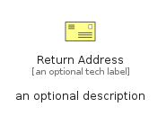
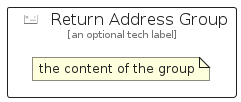

# ReturnAddress


```text
eip/MessageConstruction/ReturnAddress
```

```text
include('eip/MessageConstruction/ReturnAddress')
```


| Illustration | ReturnAddress | ReturnAddressGroup |
| :---: | :---: | :---: |
|  |  |  |


## Sprites
The item provides the following sriptes:

- `<$ReturnAddressXs>`
- `<$ReturnAddressSm>`
- `<$ReturnAddressMd>`
- `<$ReturnAddressLg>`


## ReturnAddress

### Load remotely
```plantuml
@startuml
' configures the library
!global $LIB_BASE_LOCATION="https://raw.githubusercontent.com/tmorin/plantuml-libs/master/distribution"

' loads the library's bootstrap
!include $LIB_BASE_LOCATION/bootstrap.puml

' loads the package bootstrap
include('eip/bootstrap')

' loads the Item which embeds the element ReturnAddress
include('eip/MessageConstruction/ReturnAddress')

' renders the element
ReturnAddress('ReturnAddress', 'Return Address', 'an optional tech label', 'an optional description')
@enduml
```

### Load locally
```plantuml
@startuml
' configures the library
!global $INCLUSION_MODE="local"
!global $LIB_BASE_LOCATION="../.."

' loads the library's bootstrap
!include $LIB_BASE_LOCATION/bootstrap.puml

' loads the package bootstrap
include('eip/bootstrap')

' loads the Item which embeds the element ReturnAddress
include('eip/MessageConstruction/ReturnAddress')

' renders the element
ReturnAddress('ReturnAddress', 'Return Address', 'an optional tech label', 'an optional description')
@enduml
```

## ReturnAddressGroup

### Load remotely
```plantuml
@startuml
' configures the library
!global $LIB_BASE_LOCATION="https://raw.githubusercontent.com/tmorin/plantuml-libs/master/distribution"

' loads the library's bootstrap
!include $LIB_BASE_LOCATION/bootstrap.puml

' loads the package bootstrap
include('eip/bootstrap')

' loads the Item which embeds the element ReturnAddressGroup
include('eip/MessageConstruction/ReturnAddress')

' renders the element
ReturnAddressGroup('ReturnAddressGroup', 'Return Address Group', 'an optional tech label') {
    note as note
        the content of the group
    end note
}
@enduml
```

### Load locally
```plantuml
@startuml
' configures the library
!global $INCLUSION_MODE="local"
!global $LIB_BASE_LOCATION="../.."

' loads the library's bootstrap
!include $LIB_BASE_LOCATION/bootstrap.puml

' loads the package bootstrap
include('eip/bootstrap')

' loads the Item which embeds the element ReturnAddressGroup
include('eip/MessageConstruction/ReturnAddress')

' renders the element
ReturnAddressGroup('ReturnAddressGroup', 'Return Address Group', 'an optional tech label') {
    note as note
        the content of the group
    end note
}
@enduml
```

