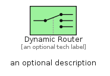
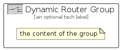

# DynamicRouter


```text
eip/MessageRouting/DynamicRouter
```

```text
include('eip/MessageRouting/DynamicRouter')
```


| Illustration | DynamicRouter | DynamicRouterGroup |
| :---: | :---: | :---: |
|  |  |  |


## Sprites
The item provides the following sriptes:

- `<$DynamicRouterXs>`
- `<$DynamicRouterSm>`
- `<$DynamicRouterMd>`
- `<$DynamicRouterLg>`


## DynamicRouter

### Load remotely
```plantuml
@startuml
' configures the library
!global $LIB_BASE_LOCATION="https://raw.githubusercontent.com/tmorin/plantuml-libs/master/distribution"

' loads the library's bootstrap
!include $LIB_BASE_LOCATION/bootstrap.puml

' loads the package bootstrap
include('eip/bootstrap')

' loads the Item which embeds the element DynamicRouter
include('eip/MessageRouting/DynamicRouter')

' renders the element
DynamicRouter('DynamicRouter', 'Dynamic Router', 'an optional tech label', 'an optional description')
@enduml
```

### Load locally
```plantuml
@startuml
' configures the library
!global $INCLUSION_MODE="local"
!global $LIB_BASE_LOCATION="../.."

' loads the library's bootstrap
!include $LIB_BASE_LOCATION/bootstrap.puml

' loads the package bootstrap
include('eip/bootstrap')

' loads the Item which embeds the element DynamicRouter
include('eip/MessageRouting/DynamicRouter')

' renders the element
DynamicRouter('DynamicRouter', 'Dynamic Router', 'an optional tech label', 'an optional description')
@enduml
```

## DynamicRouterGroup

### Load remotely
```plantuml
@startuml
' configures the library
!global $LIB_BASE_LOCATION="https://raw.githubusercontent.com/tmorin/plantuml-libs/master/distribution"

' loads the library's bootstrap
!include $LIB_BASE_LOCATION/bootstrap.puml

' loads the package bootstrap
include('eip/bootstrap')

' loads the Item which embeds the element DynamicRouterGroup
include('eip/MessageRouting/DynamicRouter')

' renders the element
DynamicRouterGroup('DynamicRouterGroup', 'Dynamic Router Group', 'an optional tech label') {
    note as note
        the content of the group
    end note
}
@enduml
```

### Load locally
```plantuml
@startuml
' configures the library
!global $INCLUSION_MODE="local"
!global $LIB_BASE_LOCATION="../.."

' loads the library's bootstrap
!include $LIB_BASE_LOCATION/bootstrap.puml

' loads the package bootstrap
include('eip/bootstrap')

' loads the Item which embeds the element DynamicRouterGroup
include('eip/MessageRouting/DynamicRouter')

' renders the element
DynamicRouterGroup('DynamicRouterGroup', 'Dynamic Router Group', 'an optional tech label') {
    note as note
        the content of the group
    end note
}
@enduml
```

