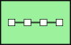
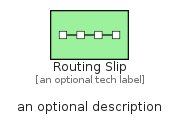
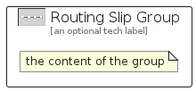

# RoutingSlip


```text
eip/MessageRouting/RoutingSlip
```

```text
include('eip/MessageRouting/RoutingSlip')
```


| Illustration | RoutingSlip | RoutingSlipGroup |
| :---: | :---: | :---: |
|  |  |  |


## Sprites
The item provides the following sriptes:

- `<$RoutingSlipXs>`
- `<$RoutingSlipSm>`
- `<$RoutingSlipMd>`
- `<$RoutingSlipLg>`


## RoutingSlip

### Load remotely
```plantuml
@startuml
' configures the library
!global $LIB_BASE_LOCATION="https://raw.githubusercontent.com/tmorin/plantuml-libs/master/distribution"

' loads the library's bootstrap
!include $LIB_BASE_LOCATION/bootstrap.puml

' loads the package bootstrap
include('eip/bootstrap')

' loads the Item which embeds the element RoutingSlip
include('eip/MessageRouting/RoutingSlip')

' renders the element
RoutingSlip('RoutingSlip', 'Routing Slip', 'an optional tech label', 'an optional description')
@enduml
```

### Load locally
```plantuml
@startuml
' configures the library
!global $INCLUSION_MODE="local"
!global $LIB_BASE_LOCATION="../.."

' loads the library's bootstrap
!include $LIB_BASE_LOCATION/bootstrap.puml

' loads the package bootstrap
include('eip/bootstrap')

' loads the Item which embeds the element RoutingSlip
include('eip/MessageRouting/RoutingSlip')

' renders the element
RoutingSlip('RoutingSlip', 'Routing Slip', 'an optional tech label', 'an optional description')
@enduml
```

## RoutingSlipGroup

### Load remotely
```plantuml
@startuml
' configures the library
!global $LIB_BASE_LOCATION="https://raw.githubusercontent.com/tmorin/plantuml-libs/master/distribution"

' loads the library's bootstrap
!include $LIB_BASE_LOCATION/bootstrap.puml

' loads the package bootstrap
include('eip/bootstrap')

' loads the Item which embeds the element RoutingSlipGroup
include('eip/MessageRouting/RoutingSlip')

' renders the element
RoutingSlipGroup('RoutingSlipGroup', 'Routing Slip Group', 'an optional tech label') {
    note as note
        the content of the group
    end note
}
@enduml
```

### Load locally
```plantuml
@startuml
' configures the library
!global $INCLUSION_MODE="local"
!global $LIB_BASE_LOCATION="../.."

' loads the library's bootstrap
!include $LIB_BASE_LOCATION/bootstrap.puml

' loads the package bootstrap
include('eip/bootstrap')

' loads the Item which embeds the element RoutingSlipGroup
include('eip/MessageRouting/RoutingSlip')

' renders the element
RoutingSlipGroup('RoutingSlipGroup', 'Routing Slip Group', 'an optional tech label') {
    note as note
        the content of the group
    end note
}
@enduml
```

