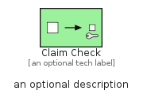
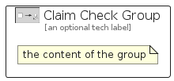

# ClaimCheck


```text
eip/MessageTransformation/ClaimCheck
```

```text
include('eip/MessageTransformation/ClaimCheck')
```


| Illustration | ClaimCheck | ClaimCheckGroup |
| :---: | :---: | :---: |
|  |  |  |


## Sprites
The item provides the following sriptes:

- `<$ClaimCheckXs>`
- `<$ClaimCheckSm>`
- `<$ClaimCheckMd>`
- `<$ClaimCheckLg>`


## ClaimCheck

### Load remotely
```plantuml
@startuml
' configures the library
!global $LIB_BASE_LOCATION="https://raw.githubusercontent.com/tmorin/plantuml-libs/master/distribution"

' loads the library's bootstrap
!include $LIB_BASE_LOCATION/bootstrap.puml

' loads the package bootstrap
include('eip/bootstrap')

' loads the Item which embeds the element ClaimCheck
include('eip/MessageTransformation/ClaimCheck')

' renders the element
ClaimCheck('ClaimCheck', 'Claim Check', 'an optional tech label', 'an optional description')
@enduml
```

### Load locally
```plantuml
@startuml
' configures the library
!global $INCLUSION_MODE="local"
!global $LIB_BASE_LOCATION="../.."

' loads the library's bootstrap
!include $LIB_BASE_LOCATION/bootstrap.puml

' loads the package bootstrap
include('eip/bootstrap')

' loads the Item which embeds the element ClaimCheck
include('eip/MessageTransformation/ClaimCheck')

' renders the element
ClaimCheck('ClaimCheck', 'Claim Check', 'an optional tech label', 'an optional description')
@enduml
```

## ClaimCheckGroup

### Load remotely
```plantuml
@startuml
' configures the library
!global $LIB_BASE_LOCATION="https://raw.githubusercontent.com/tmorin/plantuml-libs/master/distribution"

' loads the library's bootstrap
!include $LIB_BASE_LOCATION/bootstrap.puml

' loads the package bootstrap
include('eip/bootstrap')

' loads the Item which embeds the element ClaimCheckGroup
include('eip/MessageTransformation/ClaimCheck')

' renders the element
ClaimCheckGroup('ClaimCheckGroup', 'Claim Check Group', 'an optional tech label') {
    note as note
        the content of the group
    end note
}
@enduml
```

### Load locally
```plantuml
@startuml
' configures the library
!global $INCLUSION_MODE="local"
!global $LIB_BASE_LOCATION="../.."

' loads the library's bootstrap
!include $LIB_BASE_LOCATION/bootstrap.puml

' loads the package bootstrap
include('eip/bootstrap')

' loads the Item which embeds the element ClaimCheckGroup
include('eip/MessageTransformation/ClaimCheck')

' renders the element
ClaimCheckGroup('ClaimCheckGroup', 'Claim Check Group', 'an optional tech label') {
    note as note
        the content of the group
    end note
}
@enduml
```

