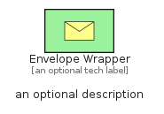
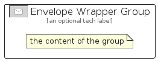

# EnvelopeWrapper


```text
eip/MessageTransformation/EnvelopeWrapper
```

```text
include('eip/MessageTransformation/EnvelopeWrapper')
```


| Illustration | EnvelopeWrapper | EnvelopeWrapperGroup |
| :---: | :---: | :---: |
|  |  |  |


## Sprites
The item provides the following sriptes:

- `<$EnvelopeWrapperXs>`
- `<$EnvelopeWrapperSm>`
- `<$EnvelopeWrapperMd>`
- `<$EnvelopeWrapperLg>`


## EnvelopeWrapper

### Load remotely
```plantuml
@startuml
' configures the library
!global $LIB_BASE_LOCATION="https://raw.githubusercontent.com/tmorin/plantuml-libs/master/distribution"

' loads the library's bootstrap
!include $LIB_BASE_LOCATION/bootstrap.puml

' loads the package bootstrap
include('eip/bootstrap')

' loads the Item which embeds the element EnvelopeWrapper
include('eip/MessageTransformation/EnvelopeWrapper')

' renders the element
EnvelopeWrapper('EnvelopeWrapper', 'Envelope Wrapper', 'an optional tech label', 'an optional description')
@enduml
```

### Load locally
```plantuml
@startuml
' configures the library
!global $INCLUSION_MODE="local"
!global $LIB_BASE_LOCATION="../.."

' loads the library's bootstrap
!include $LIB_BASE_LOCATION/bootstrap.puml

' loads the package bootstrap
include('eip/bootstrap')

' loads the Item which embeds the element EnvelopeWrapper
include('eip/MessageTransformation/EnvelopeWrapper')

' renders the element
EnvelopeWrapper('EnvelopeWrapper', 'Envelope Wrapper', 'an optional tech label', 'an optional description')
@enduml
```

## EnvelopeWrapperGroup

### Load remotely
```plantuml
@startuml
' configures the library
!global $LIB_BASE_LOCATION="https://raw.githubusercontent.com/tmorin/plantuml-libs/master/distribution"

' loads the library's bootstrap
!include $LIB_BASE_LOCATION/bootstrap.puml

' loads the package bootstrap
include('eip/bootstrap')

' loads the Item which embeds the element EnvelopeWrapperGroup
include('eip/MessageTransformation/EnvelopeWrapper')

' renders the element
EnvelopeWrapperGroup('EnvelopeWrapperGroup', 'Envelope Wrapper Group', 'an optional tech label') {
    note as note
        the content of the group
    end note
}
@enduml
```

### Load locally
```plantuml
@startuml
' configures the library
!global $INCLUSION_MODE="local"
!global $LIB_BASE_LOCATION="../.."

' loads the library's bootstrap
!include $LIB_BASE_LOCATION/bootstrap.puml

' loads the package bootstrap
include('eip/bootstrap')

' loads the Item which embeds the element EnvelopeWrapperGroup
include('eip/MessageTransformation/EnvelopeWrapper')

' renders the element
EnvelopeWrapperGroup('EnvelopeWrapperGroup', 'Envelope Wrapper Group', 'an optional tech label') {
    note as note
        the content of the group
    end note
}
@enduml
```

