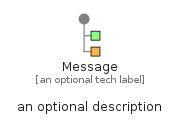
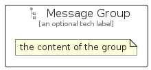

# Message


```text
eip/MessagingSystems/Message
```

```text
include('eip/MessagingSystems/Message')
```


| Illustration | Message | MessageGroup |
| :---: | :---: | :---: |
|  |  |  |


## Sprites
The item provides the following sriptes:

- `<$MessageXs>`
- `<$MessageSm>`
- `<$MessageMd>`
- `<$MessageLg>`


## Message

### Load remotely
```plantuml
@startuml
' configures the library
!global $LIB_BASE_LOCATION="https://raw.githubusercontent.com/tmorin/plantuml-libs/master/distribution"

' loads the library's bootstrap
!include $LIB_BASE_LOCATION/bootstrap.puml

' loads the package bootstrap
include('eip/bootstrap')

' loads the Item which embeds the element Message
include('eip/MessagingSystems/Message')

' renders the element
Message('Message', 'Message', 'an optional tech label', 'an optional description')
@enduml
```

### Load locally
```plantuml
@startuml
' configures the library
!global $INCLUSION_MODE="local"
!global $LIB_BASE_LOCATION="../.."

' loads the library's bootstrap
!include $LIB_BASE_LOCATION/bootstrap.puml

' loads the package bootstrap
include('eip/bootstrap')

' loads the Item which embeds the element Message
include('eip/MessagingSystems/Message')

' renders the element
Message('Message', 'Message', 'an optional tech label', 'an optional description')
@enduml
```

## MessageGroup

### Load remotely
```plantuml
@startuml
' configures the library
!global $LIB_BASE_LOCATION="https://raw.githubusercontent.com/tmorin/plantuml-libs/master/distribution"

' loads the library's bootstrap
!include $LIB_BASE_LOCATION/bootstrap.puml

' loads the package bootstrap
include('eip/bootstrap')

' loads the Item which embeds the element MessageGroup
include('eip/MessagingSystems/Message')

' renders the element
MessageGroup('MessageGroup', 'Message Group', 'an optional tech label') {
    note as note
        the content of the group
    end note
}
@enduml
```

### Load locally
```plantuml
@startuml
' configures the library
!global $INCLUSION_MODE="local"
!global $LIB_BASE_LOCATION="../.."

' loads the library's bootstrap
!include $LIB_BASE_LOCATION/bootstrap.puml

' loads the package bootstrap
include('eip/bootstrap')

' loads the Item which embeds the element MessageGroup
include('eip/MessagingSystems/Message')

' renders the element
MessageGroup('MessageGroup', 'Message Group', 'an optional tech label') {
    note as note
        the content of the group
    end note
}
@enduml
```

