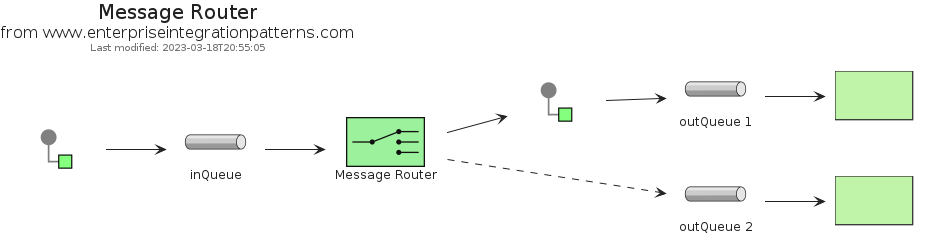
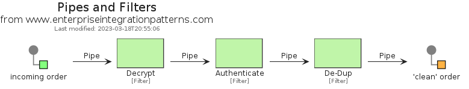
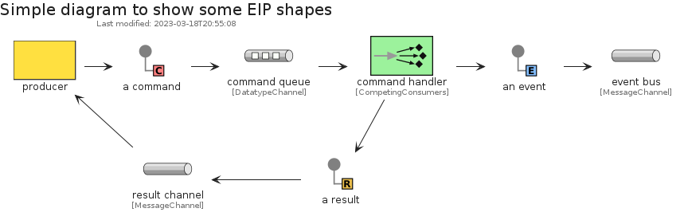

# eip

## Presentation
This package implements elements based on [codeclou/enterprise-integration-pattern-shapes-for-gliffy](https://github.com/codeclou/enterprise-integration-pattern-shapes-for-gliffy).

## Usage

### Bootstrap

The bootstrap may provide PlantUML artifacts like constants, procedures or style statements.

```plantuml
' loads the eip bootstrap
include('eip/bootstrap')
```

### Full inclusion

An additional include can be used to load all items in one shot.

 ```plantuml
' loads the bootstrap of `eip` and all related items
include('eip/full')
```

### Single inclusion

Finally, another include can be used to load the library's bootstrap, the package's bootstrap and all items' resources in one `!include` statement.

Include remotely the resources:
```plantuml
' loads the library, the bootstrap of `eip` and all related items
!include https://raw.githubusercontent.com/tmorin/plantuml-libs/master/distribution/eip/single.puml
```

Include locally the resources:
```plantuml
' configures the library
!global $INCLUSION_MODE="local"
' loads the library, the bootstrap of `eip` and all related items
!include <the relative path to the /distribution directory>/eip/single.puml
```


# Modules

The package provides 7 modules.

- [eip/MessageConstruction](../eip/MessageConstruction/README.md) with 10 items
- [eip/MessageRouting](../eip/MessageRouting/README.md) with 11 items
- [eip/MessageTransformation](../eip/MessageTransformation/README.md) with 5 items
- [eip/MessagingChannels](../eip/MessagingChannels/README.md) with 8 items
- [eip/MessagingEndpoints](../eip/MessagingEndpoints/README.md) with 11 items
- [eip/MessagingSystems](../eip/MessagingSystems/README.md) with 9 items
- [eip/SystemManagement](../eip/SystemManagement/README.md) with 7 items


# Examples

The package provides 3 examples.

## Message router

<br>
[The source file.](../eip/message_router.puml)

## Pipes and filters

<br>
[The source file.](../eip/pipes_and_filters.puml)

## Simple

<br>
[The source file.](../eip/simple.puml)


