# Element

The module contains 18 items.

- [Actor](#family-actor)
- [Aggregate](#family-aggregate)
- [Documentation](#family-documentation)
- [Message](#family-message)
- [Policy](#family-policy)
- [View](#family-view)

## Actor
| |Name|
|:---:|---|
| 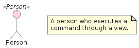 | [eventstorming/Element/Person](../../eventstorming/Element/Person.md) |
| 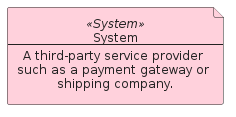 | [eventstorming/Element/System](../../eventstorming/Element/System.md) |
| 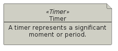 | [eventstorming/Element/Timer](../../eventstorming/Element/Timer.md) |

## Aggregate
| |Name|
|:---:|---|
| 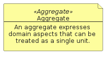 | [eventstorming/Element/Aggregate](../../eventstorming/Element/Aggregate.md) |
| 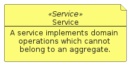 | [eventstorming/Element/Service](../../eventstorming/Element/Service.md) |

## Documentation
| |Name|
|:---:|---|
| 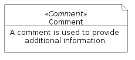 | [eventstorming/Element/Comment](../../eventstorming/Element/Comment.md) |

## Message
| |Name|
|:---:|---|
| 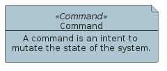 | [eventstorming/Element/Command](../../eventstorming/Element/Command.md) |
| 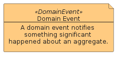 | [eventstorming/Element/DomainEvent](../../eventstorming/Element/DomainEvent.md) |
| 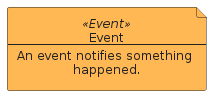 | [eventstorming/Element/Event](../../eventstorming/Element/Event.md) |
| 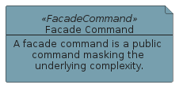 | [eventstorming/Element/FacadeCommand](../../eventstorming/Element/FacadeCommand.md) |
| 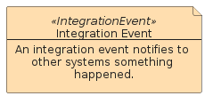 | [eventstorming/Element/IntegrationEvent](../../eventstorming/Element/IntegrationEvent.md) |
| 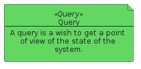 | [eventstorming/Element/Query](../../eventstorming/Element/Query.md) |
|  | [eventstorming/Element/Result](../../eventstorming/Element/Result.md) |

## Policy
| |Name|
|:---:|---|
| 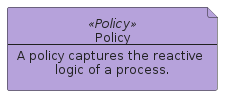 | [eventstorming/Element/Policy](../../eventstorming/Element/Policy.md) |
| 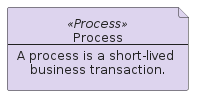 | [eventstorming/Element/Process](../../eventstorming/Element/Process.md) |
| 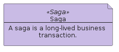 | [eventstorming/Element/Saga](../../eventstorming/Element/Saga.md) |

## View
| |Name|
|:---:|---|
| 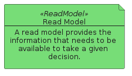 | [eventstorming/Element/ReadModel](../../eventstorming/Element/ReadModel.md) |
| 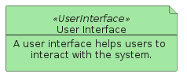 | [eventstorming/Element/UserInterface](../../eventstorming/Element/UserInterface.md) |

