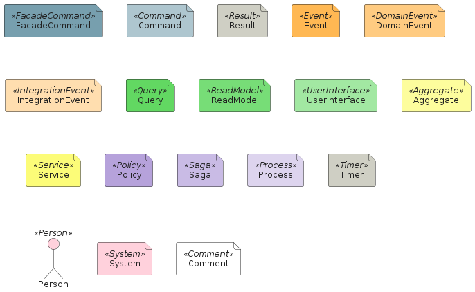
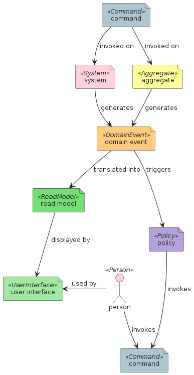
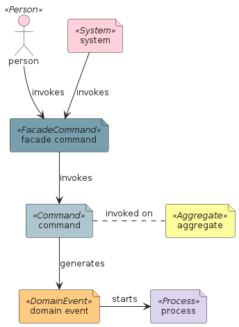
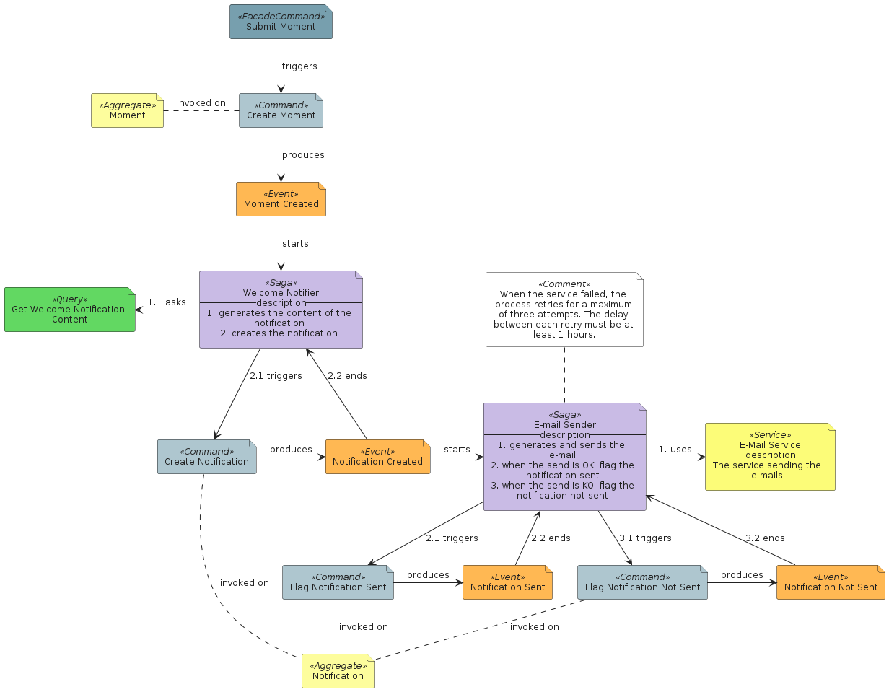

# eventstorming

## Presentation
This package implements the notation provided in [EventStorming](https://www.eventstorming.com).

## Bootstrap

The bootstrap may provide PlantUML artifacts like constants, procedures or style statements.

```plantuml
' loads the eventstorming bootstrap
include('eventstorming/bootstrap')
```


# Modules

The package provides 1 modules.

- [eventstorming/Element](../eventstorming/Element/README.md) with 18 items


# Examples

The package provides 4 examples.

## All elements

<br>
[The source file.](../eventstorming/all_elements.puml)

## Book flow

<br>
[The source file.](../eventstorming/book_flow.puml)

## Causality chain

<br>
[The source file.](../eventstorming/causality_chain.puml)

## Hoozbuzzing

<br>
[The source file.](../eventstorming/hoozbuzzing.puml)


