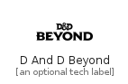

# DAndDBeyond


```text
fontawesome-5/Brands/DAndDBeyond
```

```text
include('fontawesome-5/Brands/DAndDBeyond')
```


| Illustration | DAndDBeyond |
| :---: | :---: |
|  |  |


## DAndDBeyond

### Load remotely
```plantuml
@startuml
' configures the library
!global $LIB_BASE_LOCATION="https://github.com/tmorin/plantuml-libs/distribution"

' loads the library's bootstrap
!include $LIB_BASE_LOCATION/bootstrap.puml

' loads the package bootstrap
include('fontawesome-5/bootstrap')

' loads the Item which embeds the element DAndDBeyond
include('fontawesome-5/Brands/DAndDBeyond')

' renders the element
DAndDBeyond('DAndDBeyond', 'D And D Beyond', 'an optional tech label')
@enduml
```

### Load locally
```plantuml
@startuml
' configures the library
!global $INCLUSION_MODE="local"
!global $LIB_BASE_LOCATION="../.."

' loads the library's bootstrap
!include $LIB_BASE_LOCATION/bootstrap.puml

' loads the package bootstrap
include('fontawesome-5/bootstrap')

' loads the Item which embeds the element DAndDBeyond
include('fontawesome-5/Brands/DAndDBeyond')

' renders the element
DAndDBeyond('DAndDBeyond', 'D And D Beyond', 'an optional tech label')
@enduml
```

