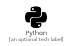

# Python


```text
fontawesome-5/Brands/Python
```

```text
include('fontawesome-5/Brands/Python')
```


| Illustration | Python |
| :---: | :---: |
|  |  |


## Python

### Load remotely
```plantuml
@startuml
' configures the library
!global $LIB_BASE_LOCATION="https://raw.githubusercontent.com/tmorin/plantuml-libs/master/distribution"

' loads the library's bootstrap
!include $LIB_BASE_LOCATION/bootstrap.puml

' loads the package bootstrap
include('fontawesome-5/bootstrap')

' loads the Item which embeds the element Python
include('fontawesome-5/Brands/Python')

' renders the element
Python('Python', 'Python', 'an optional tech label')
@enduml
```

### Load locally
```plantuml
@startuml
' configures the library
!global $INCLUSION_MODE="local"
!global $LIB_BASE_LOCATION="../.."

' loads the library's bootstrap
!include $LIB_BASE_LOCATION/bootstrap.puml

' loads the package bootstrap
include('fontawesome-5/bootstrap')

' loads the Item which embeds the element Python
include('fontawesome-5/Brands/Python')

' renders the element
Python('Python', 'Python', 'an optional tech label')
@enduml
```

