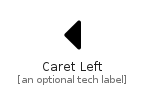

# CaretLeft


```text
fontawesome-5/Solid/CaretLeft
```

```text
include('fontawesome-5/Solid/CaretLeft')
```


| Illustration | CaretLeft |
| :---: | :---: |
|  |  |


## CaretLeft

### Load remotely
```plantuml
@startuml
' configures the library
!global $LIB_BASE_LOCATION="https://raw.githubusercontent.com/tmorin/plantuml-libs/master/distribution"

' loads the library's bootstrap
!include $LIB_BASE_LOCATION/bootstrap.puml

' loads the package bootstrap
include('fontawesome-5/bootstrap')

' loads the Item which embeds the element CaretLeft
include('fontawesome-5/Solid/CaretLeft')

' renders the element
CaretLeft('CaretLeft', 'Caret Left', 'an optional tech label')
@enduml
```

### Load locally
```plantuml
@startuml
' configures the library
!global $INCLUSION_MODE="local"
!global $LIB_BASE_LOCATION="../.."

' loads the library's bootstrap
!include $LIB_BASE_LOCATION/bootstrap.puml

' loads the package bootstrap
include('fontawesome-5/bootstrap')

' loads the Item which embeds the element CaretLeft
include('fontawesome-5/Solid/CaretLeft')

' renders the element
CaretLeft('CaretLeft', 'Caret Left', 'an optional tech label')
@enduml
```

