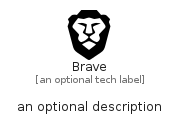

# Brave


```text
fontawesome-6/Brands/Brave
```

```text
include('fontawesome-6/Brands/Brave')
```


| Illustration | Brave |
| :---: | :---: |
|  |  |


## Sprites
The item provides the following sriptes:

- `<$BraveXs>`
- `<$BraveSm>`
- `<$BraveMd>`
- `<$BraveLg>`


## Brave

### Load remotely
```plantuml
@startuml
' configures the library
!global $LIB_BASE_LOCATION="https://raw.githubusercontent.com/tmorin/plantuml-libs/master/distribution"

' loads the library's bootstrap
!include $LIB_BASE_LOCATION/bootstrap.puml

' loads the package bootstrap
include('fontawesome-6/bootstrap')

' loads the Item which embeds the element Brave
include('fontawesome-6/Brands/Brave')

' renders the element
Brave('Brave', 'Brave', 'an optional tech label', 'an optional description')
@enduml
```

### Load locally
```plantuml
@startuml
' configures the library
!global $INCLUSION_MODE="local"
!global $LIB_BASE_LOCATION="../.."

' loads the library's bootstrap
!include $LIB_BASE_LOCATION/bootstrap.puml

' loads the package bootstrap
include('fontawesome-6/bootstrap')

' loads the Item which embeds the element Brave
include('fontawesome-6/Brands/Brave')

' renders the element
Brave('Brave', 'Brave', 'an optional tech label', 'an optional description')
@enduml
```

