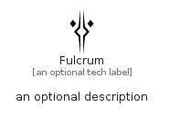

# Fulcrum


```text
fontawesome-6/Brands/Fulcrum
```

```text
include('fontawesome-6/Brands/Fulcrum')
```


| Illustration | Fulcrum |
| :---: | :---: |
|  |  |


## Sprites
The item provides the following sriptes:

- `<$FulcrumXs>`
- `<$FulcrumSm>`
- `<$FulcrumMd>`
- `<$FulcrumLg>`


## Fulcrum

### Load remotely
```plantuml
@startuml
' configures the library
!global $LIB_BASE_LOCATION="https://raw.githubusercontent.com/tmorin/plantuml-libs/master/distribution"

' loads the library's bootstrap
!include $LIB_BASE_LOCATION/bootstrap.puml

' loads the package bootstrap
include('fontawesome-6/bootstrap')

' loads the Item which embeds the element Fulcrum
include('fontawesome-6/Brands/Fulcrum')

' renders the element
Fulcrum('Fulcrum', 'Fulcrum', 'an optional tech label', 'an optional description')
@enduml
```

### Load locally
```plantuml
@startuml
' configures the library
!global $INCLUSION_MODE="local"
!global $LIB_BASE_LOCATION="../.."

' loads the library's bootstrap
!include $LIB_BASE_LOCATION/bootstrap.puml

' loads the package bootstrap
include('fontawesome-6/bootstrap')

' loads the Item which embeds the element Fulcrum
include('fontawesome-6/Brands/Fulcrum')

' renders the element
Fulcrum('Fulcrum', 'Fulcrum', 'an optional tech label', 'an optional description')
@enduml
```

