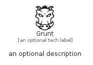

# Grunt


```text
fontawesome-6/Brands/Grunt
```

```text
include('fontawesome-6/Brands/Grunt')
```


| Illustration | Grunt |
| :---: | :---: |
|  |  |


## Sprites
The item provides the following sriptes:

- `<$GruntXs>`
- `<$GruntSm>`
- `<$GruntMd>`
- `<$GruntLg>`


## Grunt

### Load remotely
```plantuml
@startuml
' configures the library
!global $LIB_BASE_LOCATION="https://raw.githubusercontent.com/tmorin/plantuml-libs/master/distribution"

' loads the library's bootstrap
!include $LIB_BASE_LOCATION/bootstrap.puml

' loads the package bootstrap
include('fontawesome-6/bootstrap')

' loads the Item which embeds the element Grunt
include('fontawesome-6/Brands/Grunt')

' renders the element
Grunt('Grunt', 'Grunt', 'an optional tech label', 'an optional description')
@enduml
```

### Load locally
```plantuml
@startuml
' configures the library
!global $INCLUSION_MODE="local"
!global $LIB_BASE_LOCATION="../.."

' loads the library's bootstrap
!include $LIB_BASE_LOCATION/bootstrap.puml

' loads the package bootstrap
include('fontawesome-6/bootstrap')

' loads the Item which embeds the element Grunt
include('fontawesome-6/Brands/Grunt')

' renders the element
Grunt('Grunt', 'Grunt', 'an optional tech label', 'an optional description')
@enduml
```

