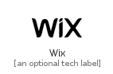

# Wix


```text
fontawesome-6/Brands/Wix
```

```text
include('fontawesome-6/Brands/Wix')
```


| Illustration | Wix |
| :---: | :---: |
|  |  |


## Sprites
The item provides the following sriptes:

- `<$WixXs>`
- `<$WixSm>`
- `<$WixMd>`
- `<$WixLg>`


## Wix

### Load remotely
```plantuml
@startuml
' configures the library
!global $LIB_BASE_LOCATION="https://raw.githubusercontent.com/tmorin/plantuml-libs/master/distribution"

' loads the library's bootstrap
!include $LIB_BASE_LOCATION/bootstrap.puml

' loads the package bootstrap
include('fontawesome-6/bootstrap')

' loads the Item which embeds the element Wix
include('fontawesome-6/Brands/Wix')

' renders the element
Wix('Wix', 'Wix', 'an optional tech label', 'an optional description')
@enduml
```

### Load locally
```plantuml
@startuml
' configures the library
!global $INCLUSION_MODE="local"
!global $LIB_BASE_LOCATION="../.."

' loads the library's bootstrap
!include $LIB_BASE_LOCATION/bootstrap.puml

' loads the package bootstrap
include('fontawesome-6/bootstrap')

' loads the Item which embeds the element Wix
include('fontawesome-6/Brands/Wix')

' renders the element
Wix('Wix', 'Wix', 'an optional tech label', 'an optional description')
@enduml
```

