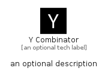

# YCombinator


```text
fontawesome-6/Brands/YCombinator
```

```text
include('fontawesome-6/Brands/YCombinator')
```


| Illustration | YCombinator |
| :---: | :---: |
|  |  |


## Sprites
The item provides the following sriptes:

- `<$YCombinatorXs>`
- `<$YCombinatorSm>`
- `<$YCombinatorMd>`
- `<$YCombinatorLg>`


## YCombinator

### Load remotely
```plantuml
@startuml
' configures the library
!global $LIB_BASE_LOCATION="https://raw.githubusercontent.com/tmorin/plantuml-libs/master/distribution"

' loads the library's bootstrap
!include $LIB_BASE_LOCATION/bootstrap.puml

' loads the package bootstrap
include('fontawesome-6/bootstrap')

' loads the Item which embeds the element YCombinator
include('fontawesome-6/Brands/YCombinator')

' renders the element
YCombinator('YCombinator', 'Y Combinator', 'an optional tech label', 'an optional description')
@enduml
```

### Load locally
```plantuml
@startuml
' configures the library
!global $INCLUSION_MODE="local"
!global $LIB_BASE_LOCATION="../.."

' loads the library's bootstrap
!include $LIB_BASE_LOCATION/bootstrap.puml

' loads the package bootstrap
include('fontawesome-6/bootstrap')

' loads the Item which embeds the element YCombinator
include('fontawesome-6/Brands/YCombinator')

' renders the element
YCombinator('YCombinator', 'Y Combinator', 'an optional tech label', 'an optional description')
@enduml
```

