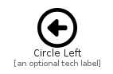

# CircleLeft


```text
fontawesome-6/Regular/CircleLeft
```

```text
include('fontawesome-6/Regular/CircleLeft')
```


| Illustration | CircleLeft |
| :---: | :---: |
|  |  |


## Sprites
The item provides the following sriptes:

- `<$CircleLeftXs>`
- `<$CircleLeftSm>`
- `<$CircleLeftMd>`
- `<$CircleLeftLg>`


## CircleLeft

### Load remotely
```plantuml
@startuml
' configures the library
!global $LIB_BASE_LOCATION="https://raw.githubusercontent.com/tmorin/plantuml-libs/master/distribution"

' loads the library's bootstrap
!include $LIB_BASE_LOCATION/bootstrap.puml

' loads the package bootstrap
include('fontawesome-6/bootstrap')

' loads the Item which embeds the element CircleLeft
include('fontawesome-6/Regular/CircleLeft')

' renders the element
CircleLeft('CircleLeft', 'Circle Left', 'an optional tech label', 'an optional description')
@enduml
```

### Load locally
```plantuml
@startuml
' configures the library
!global $INCLUSION_MODE="local"
!global $LIB_BASE_LOCATION="../.."

' loads the library's bootstrap
!include $LIB_BASE_LOCATION/bootstrap.puml

' loads the package bootstrap
include('fontawesome-6/bootstrap')

' loads the Item which embeds the element CircleLeft
include('fontawesome-6/Regular/CircleLeft')

' renders the element
CircleLeft('CircleLeft', 'Circle Left', 'an optional tech label', 'an optional description')
@enduml
```

