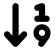
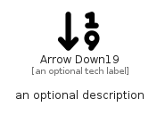

# ArrowDown19


```text
fontawesome-6/Solid/ArrowDown19
```

```text
include('fontawesome-6/Solid/ArrowDown19')
```


| Illustration | ArrowDown19 |
| :---: | :---: |
|  |  |


## Sprites
The item provides the following sriptes:

- `<$ArrowDown19Xs>`
- `<$ArrowDown19Sm>`
- `<$ArrowDown19Md>`
- `<$ArrowDown19Lg>`


## ArrowDown19

### Load remotely
```plantuml
@startuml
' configures the library
!global $LIB_BASE_LOCATION="https://raw.githubusercontent.com/tmorin/plantuml-libs/master/distribution"

' loads the library's bootstrap
!include $LIB_BASE_LOCATION/bootstrap.puml

' loads the package bootstrap
include('fontawesome-6/bootstrap')

' loads the Item which embeds the element ArrowDown19
include('fontawesome-6/Solid/ArrowDown19')

' renders the element
ArrowDown19('ArrowDown19', 'Arrow Down19', 'an optional tech label', 'an optional description')
@enduml
```

### Load locally
```plantuml
@startuml
' configures the library
!global $INCLUSION_MODE="local"
!global $LIB_BASE_LOCATION="../.."

' loads the library's bootstrap
!include $LIB_BASE_LOCATION/bootstrap.puml

' loads the package bootstrap
include('fontawesome-6/bootstrap')

' loads the Item which embeds the element ArrowDown19
include('fontawesome-6/Solid/ArrowDown19')

' renders the element
ArrowDown19('ArrowDown19', 'Arrow Down19', 'an optional tech label', 'an optional description')
@enduml
```

