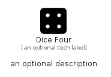

# DiceFour


```text
fontawesome-6/Solid/DiceFour
```

```text
include('fontawesome-6/Solid/DiceFour')
```


| Illustration | DiceFour |
| :---: | :---: |
|  |  |


## Sprites
The item provides the following sriptes:

- `<$DiceFourXs>`
- `<$DiceFourSm>`
- `<$DiceFourMd>`
- `<$DiceFourLg>`


## DiceFour

### Load remotely
```plantuml
@startuml
' configures the library
!global $LIB_BASE_LOCATION="https://raw.githubusercontent.com/tmorin/plantuml-libs/master/distribution"

' loads the library's bootstrap
!include $LIB_BASE_LOCATION/bootstrap.puml

' loads the package bootstrap
include('fontawesome-6/bootstrap')

' loads the Item which embeds the element DiceFour
include('fontawesome-6/Solid/DiceFour')

' renders the element
DiceFour('DiceFour', 'Dice Four', 'an optional tech label', 'an optional description')
@enduml
```

### Load locally
```plantuml
@startuml
' configures the library
!global $INCLUSION_MODE="local"
!global $LIB_BASE_LOCATION="../.."

' loads the library's bootstrap
!include $LIB_BASE_LOCATION/bootstrap.puml

' loads the package bootstrap
include('fontawesome-6/bootstrap')

' loads the Item which embeds the element DiceFour
include('fontawesome-6/Solid/DiceFour')

' renders the element
DiceFour('DiceFour', 'Dice Four', 'an optional tech label', 'an optional description')
@enduml
```

