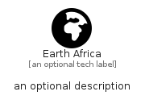

# EarthAfrica


```text
fontawesome-6/Solid/EarthAfrica
```

```text
include('fontawesome-6/Solid/EarthAfrica')
```


| Illustration | EarthAfrica |
| :---: | :---: |
|  |  |


## Sprites
The item provides the following sriptes:

- `<$EarthAfricaXs>`
- `<$EarthAfricaSm>`
- `<$EarthAfricaMd>`
- `<$EarthAfricaLg>`


## EarthAfrica

### Load remotely
```plantuml
@startuml
' configures the library
!global $LIB_BASE_LOCATION="https://raw.githubusercontent.com/tmorin/plantuml-libs/master/distribution"

' loads the library's bootstrap
!include $LIB_BASE_LOCATION/bootstrap.puml

' loads the package bootstrap
include('fontawesome-6/bootstrap')

' loads the Item which embeds the element EarthAfrica
include('fontawesome-6/Solid/EarthAfrica')

' renders the element
EarthAfrica('EarthAfrica', 'Earth Africa', 'an optional tech label', 'an optional description')
@enduml
```

### Load locally
```plantuml
@startuml
' configures the library
!global $INCLUSION_MODE="local"
!global $LIB_BASE_LOCATION="../.."

' loads the library's bootstrap
!include $LIB_BASE_LOCATION/bootstrap.puml

' loads the package bootstrap
include('fontawesome-6/bootstrap')

' loads the Item which embeds the element EarthAfrica
include('fontawesome-6/Solid/EarthAfrica')

' renders the element
EarthAfrica('EarthAfrica', 'Earth Africa', 'an optional tech label', 'an optional description')
@enduml
```

