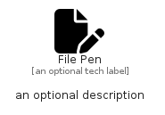

# FilePen


```text
fontawesome-6/Solid/FilePen
```

```text
include('fontawesome-6/Solid/FilePen')
```


| Illustration | FilePen |
| :---: | :---: |
|  |  |


## Sprites
The item provides the following sriptes:

- `<$FilePenXs>`
- `<$FilePenSm>`
- `<$FilePenMd>`
- `<$FilePenLg>`


## FilePen

### Load remotely
```plantuml
@startuml
' configures the library
!global $LIB_BASE_LOCATION="https://raw.githubusercontent.com/tmorin/plantuml-libs/master/distribution"

' loads the library's bootstrap
!include $LIB_BASE_LOCATION/bootstrap.puml

' loads the package bootstrap
include('fontawesome-6/bootstrap')

' loads the Item which embeds the element FilePen
include('fontawesome-6/Solid/FilePen')

' renders the element
FilePen('FilePen', 'File Pen', 'an optional tech label', 'an optional description')
@enduml
```

### Load locally
```plantuml
@startuml
' configures the library
!global $INCLUSION_MODE="local"
!global $LIB_BASE_LOCATION="../.."

' loads the library's bootstrap
!include $LIB_BASE_LOCATION/bootstrap.puml

' loads the package bootstrap
include('fontawesome-6/bootstrap')

' loads the Item which embeds the element FilePen
include('fontawesome-6/Solid/FilePen')

' renders the element
FilePen('FilePen', 'File Pen', 'an optional tech label', 'an optional description')
@enduml
```

