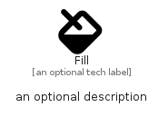

# Fill


```text
fontawesome-6/Solid/Fill
```

```text
include('fontawesome-6/Solid/Fill')
```


| Illustration | Fill |
| :---: | :---: |
|  |  |


## Sprites
The item provides the following sriptes:

- `<$FillXs>`
- `<$FillSm>`
- `<$FillMd>`
- `<$FillLg>`


## Fill

### Load remotely
```plantuml
@startuml
' configures the library
!global $LIB_BASE_LOCATION="https://raw.githubusercontent.com/tmorin/plantuml-libs/master/distribution"

' loads the library's bootstrap
!include $LIB_BASE_LOCATION/bootstrap.puml

' loads the package bootstrap
include('fontawesome-6/bootstrap')

' loads the Item which embeds the element Fill
include('fontawesome-6/Solid/Fill')

' renders the element
Fill('Fill', 'Fill', 'an optional tech label', 'an optional description')
@enduml
```

### Load locally
```plantuml
@startuml
' configures the library
!global $INCLUSION_MODE="local"
!global $LIB_BASE_LOCATION="../.."

' loads the library's bootstrap
!include $LIB_BASE_LOCATION/bootstrap.puml

' loads the package bootstrap
include('fontawesome-6/bootstrap')

' loads the Item which embeds the element Fill
include('fontawesome-6/Solid/Fill')

' renders the element
Fill('Fill', 'Fill', 'an optional tech label', 'an optional description')
@enduml
```

