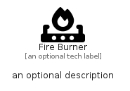

# FireBurner


```text
fontawesome-6/Solid/FireBurner
```

```text
include('fontawesome-6/Solid/FireBurner')
```


| Illustration | FireBurner |
| :---: | :---: |
|  |  |


## Sprites
The item provides the following sriptes:

- `<$FireBurnerXs>`
- `<$FireBurnerSm>`
- `<$FireBurnerMd>`
- `<$FireBurnerLg>`


## FireBurner

### Load remotely
```plantuml
@startuml
' configures the library
!global $LIB_BASE_LOCATION="https://raw.githubusercontent.com/tmorin/plantuml-libs/master/distribution"

' loads the library's bootstrap
!include $LIB_BASE_LOCATION/bootstrap.puml

' loads the package bootstrap
include('fontawesome-6/bootstrap')

' loads the Item which embeds the element FireBurner
include('fontawesome-6/Solid/FireBurner')

' renders the element
FireBurner('FireBurner', 'Fire Burner', 'an optional tech label', 'an optional description')
@enduml
```

### Load locally
```plantuml
@startuml
' configures the library
!global $INCLUSION_MODE="local"
!global $LIB_BASE_LOCATION="../.."

' loads the library's bootstrap
!include $LIB_BASE_LOCATION/bootstrap.puml

' loads the package bootstrap
include('fontawesome-6/bootstrap')

' loads the Item which embeds the element FireBurner
include('fontawesome-6/Solid/FireBurner')

' renders the element
FireBurner('FireBurner', 'Fire Burner', 'an optional tech label', 'an optional description')
@enduml
```

