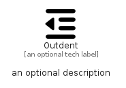

# Outdent


```text
fontawesome-6/Solid/Outdent
```

```text
include('fontawesome-6/Solid/Outdent')
```


| Illustration | Outdent |
| :---: | :---: |
|  |  |


## Sprites
The item provides the following sriptes:

- `<$OutdentXs>`
- `<$OutdentSm>`
- `<$OutdentMd>`
- `<$OutdentLg>`


## Outdent

### Load remotely
```plantuml
@startuml
' configures the library
!global $LIB_BASE_LOCATION="https://raw.githubusercontent.com/tmorin/plantuml-libs/master/distribution"

' loads the library's bootstrap
!include $LIB_BASE_LOCATION/bootstrap.puml

' loads the package bootstrap
include('fontawesome-6/bootstrap')

' loads the Item which embeds the element Outdent
include('fontawesome-6/Solid/Outdent')

' renders the element
Outdent('Outdent', 'Outdent', 'an optional tech label', 'an optional description')
@enduml
```

### Load locally
```plantuml
@startuml
' configures the library
!global $INCLUSION_MODE="local"
!global $LIB_BASE_LOCATION="../.."

' loads the library's bootstrap
!include $LIB_BASE_LOCATION/bootstrap.puml

' loads the package bootstrap
include('fontawesome-6/bootstrap')

' loads the Item which embeds the element Outdent
include('fontawesome-6/Solid/Outdent')

' renders the element
Outdent('Outdent', 'Outdent', 'an optional tech label', 'an optional description')
@enduml
```

