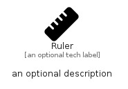

# Ruler


```text
fontawesome-6/Solid/Ruler
```

```text
include('fontawesome-6/Solid/Ruler')
```


| Illustration | Ruler |
| :---: | :---: |
|  |  |


## Sprites
The item provides the following sriptes:

- `<$RulerXs>`
- `<$RulerSm>`
- `<$RulerMd>`
- `<$RulerLg>`


## Ruler

### Load remotely
```plantuml
@startuml
' configures the library
!global $LIB_BASE_LOCATION="https://raw.githubusercontent.com/tmorin/plantuml-libs/master/distribution"

' loads the library's bootstrap
!include $LIB_BASE_LOCATION/bootstrap.puml

' loads the package bootstrap
include('fontawesome-6/bootstrap')

' loads the Item which embeds the element Ruler
include('fontawesome-6/Solid/Ruler')

' renders the element
Ruler('Ruler', 'Ruler', 'an optional tech label', 'an optional description')
@enduml
```

### Load locally
```plantuml
@startuml
' configures the library
!global $INCLUSION_MODE="local"
!global $LIB_BASE_LOCATION="../.."

' loads the library's bootstrap
!include $LIB_BASE_LOCATION/bootstrap.puml

' loads the package bootstrap
include('fontawesome-6/bootstrap')

' loads the Item which embeds the element Ruler
include('fontawesome-6/Solid/Ruler')

' renders the element
Ruler('Ruler', 'Ruler', 'an optional tech label', 'an optional description')
@enduml
```

