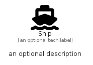

# Ship


```text
fontawesome-6/Solid/Ship
```

```text
include('fontawesome-6/Solid/Ship')
```


| Illustration | Ship |
| :---: | :---: |
|  |  |


## Sprites
The item provides the following sriptes:

- `<$ShipXs>`
- `<$ShipSm>`
- `<$ShipMd>`
- `<$ShipLg>`


## Ship

### Load remotely
```plantuml
@startuml
' configures the library
!global $LIB_BASE_LOCATION="https://raw.githubusercontent.com/tmorin/plantuml-libs/master/distribution"

' loads the library's bootstrap
!include $LIB_BASE_LOCATION/bootstrap.puml

' loads the package bootstrap
include('fontawesome-6/bootstrap')

' loads the Item which embeds the element Ship
include('fontawesome-6/Solid/Ship')

' renders the element
Ship('Ship', 'Ship', 'an optional tech label', 'an optional description')
@enduml
```

### Load locally
```plantuml
@startuml
' configures the library
!global $INCLUSION_MODE="local"
!global $LIB_BASE_LOCATION="../.."

' loads the library's bootstrap
!include $LIB_BASE_LOCATION/bootstrap.puml

' loads the package bootstrap
include('fontawesome-6/bootstrap')

' loads the Item which embeds the element Ship
include('fontawesome-6/Solid/Ship')

' renders the element
Ship('Ship', 'Ship', 'an optional tech label', 'an optional description')
@enduml
```

