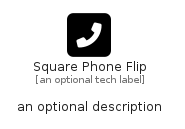

# SquarePhoneFlip


```text
fontawesome-6/Solid/SquarePhoneFlip
```

```text
include('fontawesome-6/Solid/SquarePhoneFlip')
```


| Illustration | SquarePhoneFlip |
| :---: | :---: |
|  |  |


## Sprites
The item provides the following sriptes:

- `<$SquarePhoneFlipXs>`
- `<$SquarePhoneFlipSm>`
- `<$SquarePhoneFlipMd>`
- `<$SquarePhoneFlipLg>`


## SquarePhoneFlip

### Load remotely
```plantuml
@startuml
' configures the library
!global $LIB_BASE_LOCATION="https://raw.githubusercontent.com/tmorin/plantuml-libs/master/distribution"

' loads the library's bootstrap
!include $LIB_BASE_LOCATION/bootstrap.puml

' loads the package bootstrap
include('fontawesome-6/bootstrap')

' loads the Item which embeds the element SquarePhoneFlip
include('fontawesome-6/Solid/SquarePhoneFlip')

' renders the element
SquarePhoneFlip('SquarePhoneFlip', 'Square Phone Flip', 'an optional tech label', 'an optional description')
@enduml
```

### Load locally
```plantuml
@startuml
' configures the library
!global $INCLUSION_MODE="local"
!global $LIB_BASE_LOCATION="../.."

' loads the library's bootstrap
!include $LIB_BASE_LOCATION/bootstrap.puml

' loads the package bootstrap
include('fontawesome-6/bootstrap')

' loads the Item which embeds the element SquarePhoneFlip
include('fontawesome-6/Solid/SquarePhoneFlip')

' renders the element
SquarePhoneFlip('SquarePhoneFlip', 'Square Phone Flip', 'an optional tech label', 'an optional description')
@enduml
```

