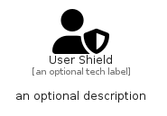

# UserShield


```text
fontawesome-6/Solid/UserShield
```

```text
include('fontawesome-6/Solid/UserShield')
```


| Illustration | UserShield |
| :---: | :---: |
|  |  |


## Sprites
The item provides the following sriptes:

- `<$UserShieldXs>`
- `<$UserShieldSm>`
- `<$UserShieldMd>`
- `<$UserShieldLg>`


## UserShield

### Load remotely
```plantuml
@startuml
' configures the library
!global $LIB_BASE_LOCATION="https://raw.githubusercontent.com/tmorin/plantuml-libs/master/distribution"

' loads the library's bootstrap
!include $LIB_BASE_LOCATION/bootstrap.puml

' loads the package bootstrap
include('fontawesome-6/bootstrap')

' loads the Item which embeds the element UserShield
include('fontawesome-6/Solid/UserShield')

' renders the element
UserShield('UserShield', 'User Shield', 'an optional tech label', 'an optional description')
@enduml
```

### Load locally
```plantuml
@startuml
' configures the library
!global $INCLUSION_MODE="local"
!global $LIB_BASE_LOCATION="../.."

' loads the library's bootstrap
!include $LIB_BASE_LOCATION/bootstrap.puml

' loads the package bootstrap
include('fontawesome-6/bootstrap')

' loads the Item which embeds the element UserShield
include('fontawesome-6/Solid/UserShield')

' renders the element
UserShield('UserShield', 'User Shield', 'an optional tech label', 'an optional description')
@enduml
```

