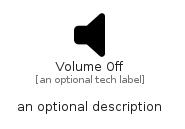

# VolumeOff


```text
fontawesome-6/Solid/VolumeOff
```

```text
include('fontawesome-6/Solid/VolumeOff')
```


| Illustration | VolumeOff |
| :---: | :---: |
|  |  |


## Sprites
The item provides the following sriptes:

- `<$VolumeOffXs>`
- `<$VolumeOffSm>`
- `<$VolumeOffMd>`
- `<$VolumeOffLg>`


## VolumeOff

### Load remotely
```plantuml
@startuml
' configures the library
!global $LIB_BASE_LOCATION="https://raw.githubusercontent.com/tmorin/plantuml-libs/master/distribution"

' loads the library's bootstrap
!include $LIB_BASE_LOCATION/bootstrap.puml

' loads the package bootstrap
include('fontawesome-6/bootstrap')

' loads the Item which embeds the element VolumeOff
include('fontawesome-6/Solid/VolumeOff')

' renders the element
VolumeOff('VolumeOff', 'Volume Off', 'an optional tech label', 'an optional description')
@enduml
```

### Load locally
```plantuml
@startuml
' configures the library
!global $INCLUSION_MODE="local"
!global $LIB_BASE_LOCATION="../.."

' loads the library's bootstrap
!include $LIB_BASE_LOCATION/bootstrap.puml

' loads the package bootstrap
include('fontawesome-6/bootstrap')

' loads the Item which embeds the element VolumeOff
include('fontawesome-6/Solid/VolumeOff')

' renders the element
VolumeOff('VolumeOff', 'Volume Off', 'an optional tech label', 'an optional description')
@enduml
```

