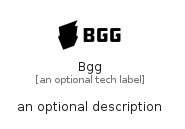

# Bgg


```text
fontawesome/Brands/Bgg
```

```text
include('fontawesome/Brands/Bgg')
```


| Illustration | Bgg |
| :---: | :---: |
|  |  |


## Sprites
The item provides the following sriptes:

- `<$BggXs>`
- `<$BggSm>`
- `<$BggMd>`
- `<$BggLg>`


## Bgg

### Load remotely
```plantuml
@startuml
' configures the library
!global $LIB_BASE_LOCATION="https://raw.githubusercontent.com/tmorin/plantuml-libs/master/distribution"

' loads the library's bootstrap
!include $LIB_BASE_LOCATION/bootstrap.puml

' loads the package bootstrap
include('fontawesome/bootstrap')

' loads the Item which embeds the element Bgg
include('fontawesome/Brands/Bgg')

' renders the element
Bgg('Bgg', 'Bgg', 'an optional tech label', 'an optional description')
@enduml
```

### Load locally
```plantuml
@startuml
' configures the library
!global $INCLUSION_MODE="local"
!global $LIB_BASE_LOCATION="../.."

' loads the library's bootstrap
!include $LIB_BASE_LOCATION/bootstrap.puml

' loads the package bootstrap
include('fontawesome/bootstrap')

' loads the Item which embeds the element Bgg
include('fontawesome/Brands/Bgg')

' renders the element
Bgg('Bgg', 'Bgg', 'an optional tech label', 'an optional description')
@enduml
```

