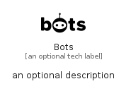

# Bots


```text
fontawesome/Brands/Bots
```

```text
include('fontawesome/Brands/Bots')
```


| Illustration | Bots |
| :---: | :---: |
|  |  |


## Sprites
The item provides the following sriptes:

- `<$BotsXs>`
- `<$BotsSm>`
- `<$BotsMd>`
- `<$BotsLg>`


## Bots

### Load remotely
```plantuml
@startuml
' configures the library
!global $LIB_BASE_LOCATION="https://raw.githubusercontent.com/tmorin/plantuml-libs/master/distribution"

' loads the library's bootstrap
!include $LIB_BASE_LOCATION/bootstrap.puml

' loads the package bootstrap
include('fontawesome/bootstrap')

' loads the Item which embeds the element Bots
include('fontawesome/Brands/Bots')

' renders the element
Bots('Bots', 'Bots', 'an optional tech label', 'an optional description')
@enduml
```

### Load locally
```plantuml
@startuml
' configures the library
!global $INCLUSION_MODE="local"
!global $LIB_BASE_LOCATION="../.."

' loads the library's bootstrap
!include $LIB_BASE_LOCATION/bootstrap.puml

' loads the package bootstrap
include('fontawesome/bootstrap')

' loads the Item which embeds the element Bots
include('fontawesome/Brands/Bots')

' renders the element
Bots('Bots', 'Bots', 'an optional tech label', 'an optional description')
@enduml
```

