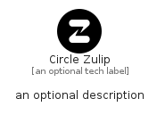

# CircleZulip


```text
fontawesome/Brands/CircleZulip
```

```text
include('fontawesome/Brands/CircleZulip')
```


| Illustration | CircleZulip |
| :---: | :---: |
|  |  |


## Sprites
The item provides the following sriptes:

- `<$CircleZulipXs>`
- `<$CircleZulipSm>`
- `<$CircleZulipMd>`
- `<$CircleZulipLg>`


## CircleZulip

### Load remotely
```plantuml
@startuml
' configures the library
!global $LIB_BASE_LOCATION="https://raw.githubusercontent.com/tmorin/plantuml-libs/master/distribution"

' loads the library's bootstrap
!include $LIB_BASE_LOCATION/bootstrap.puml

' loads the package bootstrap
include('fontawesome/bootstrap')

' loads the Item which embeds the element CircleZulip
include('fontawesome/Brands/CircleZulip')

' renders the element
CircleZulip('CircleZulip', 'Circle Zulip', 'an optional tech label', 'an optional description')
@enduml
```

### Load locally
```plantuml
@startuml
' configures the library
!global $INCLUSION_MODE="local"
!global $LIB_BASE_LOCATION="../.."

' loads the library's bootstrap
!include $LIB_BASE_LOCATION/bootstrap.puml

' loads the package bootstrap
include('fontawesome/bootstrap')

' loads the Item which embeds the element CircleZulip
include('fontawesome/Brands/CircleZulip')

' renders the element
CircleZulip('CircleZulip', 'Circle Zulip', 'an optional tech label', 'an optional description')
@enduml
```

