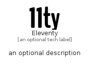

# Eleventy


```text
fontawesome/Brands/Eleventy
```

```text
include('fontawesome/Brands/Eleventy')
```


| Illustration | Eleventy |
| :---: | :---: |
|  |  |


## Sprites
The item provides the following sriptes:

- `<$EleventyXs>`
- `<$EleventySm>`
- `<$EleventyMd>`
- `<$EleventyLg>`


## Eleventy

### Load remotely
```plantuml
@startuml
' configures the library
!global $LIB_BASE_LOCATION="https://raw.githubusercontent.com/tmorin/plantuml-libs/master/distribution"

' loads the library's bootstrap
!include $LIB_BASE_LOCATION/bootstrap.puml

' loads the package bootstrap
include('fontawesome/bootstrap')

' loads the Item which embeds the element Eleventy
include('fontawesome/Brands/Eleventy')

' renders the element
Eleventy('Eleventy', 'Eleventy', 'an optional tech label', 'an optional description')
@enduml
```

### Load locally
```plantuml
@startuml
' configures the library
!global $INCLUSION_MODE="local"
!global $LIB_BASE_LOCATION="../.."

' loads the library's bootstrap
!include $LIB_BASE_LOCATION/bootstrap.puml

' loads the package bootstrap
include('fontawesome/bootstrap')

' loads the Item which embeds the element Eleventy
include('fontawesome/Brands/Eleventy')

' renders the element
Eleventy('Eleventy', 'Eleventy', 'an optional tech label', 'an optional description')
@enduml
```

