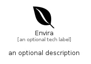

# Envira


```text
fontawesome/Brands/Envira
```

```text
include('fontawesome/Brands/Envira')
```


| Illustration | Envira |
| :---: | :---: |
|  |  |


## Sprites
The item provides the following sriptes:

- `<$EnviraXs>`
- `<$EnviraSm>`
- `<$EnviraMd>`
- `<$EnviraLg>`


## Envira

### Load remotely
```plantuml
@startuml
' configures the library
!global $LIB_BASE_LOCATION="https://raw.githubusercontent.com/tmorin/plantuml-libs/master/distribution"

' loads the library's bootstrap
!include $LIB_BASE_LOCATION/bootstrap.puml

' loads the package bootstrap
include('fontawesome/bootstrap')

' loads the Item which embeds the element Envira
include('fontawesome/Brands/Envira')

' renders the element
Envira('Envira', 'Envira', 'an optional tech label', 'an optional description')
@enduml
```

### Load locally
```plantuml
@startuml
' configures the library
!global $INCLUSION_MODE="local"
!global $LIB_BASE_LOCATION="../.."

' loads the library's bootstrap
!include $LIB_BASE_LOCATION/bootstrap.puml

' loads the package bootstrap
include('fontawesome/bootstrap')

' loads the Item which embeds the element Envira
include('fontawesome/Brands/Envira')

' renders the element
Envira('Envira', 'Envira', 'an optional tech label', 'an optional description')
@enduml
```

