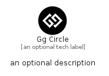

# GgCircle


```text
fontawesome/Brands/GgCircle
```

```text
include('fontawesome/Brands/GgCircle')
```


| Illustration | GgCircle |
| :---: | :---: |
|  |  |


## Sprites
The item provides the following sriptes:

- `<$GgCircleXs>`
- `<$GgCircleSm>`
- `<$GgCircleMd>`
- `<$GgCircleLg>`


## GgCircle

### Load remotely
```plantuml
@startuml
' configures the library
!global $LIB_BASE_LOCATION="https://raw.githubusercontent.com/tmorin/plantuml-libs/master/distribution"

' loads the library's bootstrap
!include $LIB_BASE_LOCATION/bootstrap.puml

' loads the package bootstrap
include('fontawesome/bootstrap')

' loads the Item which embeds the element GgCircle
include('fontawesome/Brands/GgCircle')

' renders the element
GgCircle('GgCircle', 'Gg Circle', 'an optional tech label', 'an optional description')
@enduml
```

### Load locally
```plantuml
@startuml
' configures the library
!global $INCLUSION_MODE="local"
!global $LIB_BASE_LOCATION="../.."

' loads the library's bootstrap
!include $LIB_BASE_LOCATION/bootstrap.puml

' loads the package bootstrap
include('fontawesome/bootstrap')

' loads the Item which embeds the element GgCircle
include('fontawesome/Brands/GgCircle')

' renders the element
GgCircle('GgCircle', 'Gg Circle', 'an optional tech label', 'an optional description')
@enduml
```

